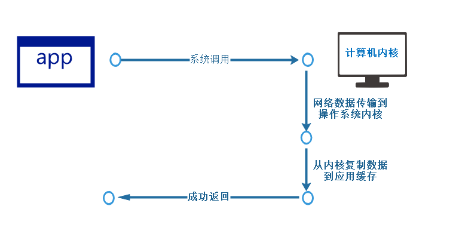

# 基于BIO实现网络通信



## 客户端

```java
public class Client {
    private static final String DEFAULT_HOST = "127.0.0.1";
    private static final int DEFAULT_PORT = 9999;
    private static Socket socket = null;
    private static final String QUIT = "quit";
    private static BufferedReader scanner = null;

    public static void main(String[] args) {
        try {
            socket = new Socket(DEFAULT_HOST, DEFAULT_PORT);
             scanner = new BufferedReader(new InputStreamReader(System.in));

            BufferedReader reader = new BufferedReader(new InputStreamReader(socket.getInputStream()));
            BufferedWriter writer = new BufferedWriter(new OutputStreamWriter(socket.getOutputStream()));
            while(true){
                String msg = scanner.readLine();
                if("quit".equals(msg)){
                    System.out.println("关闭客户端");
                    break;
                }

                writer.write(msg+"\n");
                //必须要刷新，否则Socket会一直陷入阻塞，直到缓冲区存满
                writer.flush();

                String serverMsg = reader.readLine();
                System.out.println("服务器返回消息："+serverMsg);

            }

        } catch (IOException e) {
            e.printStackTrace();
        } finally {
            if(socket != null){
                try {
                    socket.close();
                } catch (IOException e) {
                    e.printStackTrace();
                }
            }
            if (scanner != null){
                try {
                    scanner.close();
                } catch (IOException e) {
                    e.printStackTrace();
                }
            }
        }

    }
}

```


## 服务端

```java

public class Server {
    private static final int DEFAULT_PORT = 9999;
    private static Socket socket = null;
    private static ServerSocket serverSocket = null;
    private static final String QUIT = "stop";

    public static void main(String[] args) {
        try {
             serverSocket = new ServerSocket(DEFAULT_PORT);
            while(true){
                //serverSocket.accept()为阻塞性调用，需要不断地轮询看是否有响应
                socket = serverSocket.accept();
                System.out.println("服务器已经连接客户端："+socket.getPort());
                BufferedReader reader = new BufferedReader(new InputStreamReader(socket.getInputStream()));
                BufferedWriter writer = new BufferedWriter(new OutputStreamWriter(socket.getOutputStream()));
                String clientMsg = null;
                while((clientMsg = reader.readLine()) != null){

                    System.out.println("客户端消息："+clientMsg);
                    writer.write(clientMsg+"\n");
                    //必须要刷新，否则Socket会一直陷入阻塞，直到缓冲区存满
                    writer.flush();
                    if(QUIT.equals(clientMsg)){
                        System.out.println("客户端退出,服务器关闭");
                        break;
                    }
                }
            }
        }catch (Exception e){

        }finally {
            if(serverSocket != null){
                try {
                    serverSocket.close();
                    System.out.println("关闭ServerSocket");
                } catch (IOException e) {
                    e.printStackTrace();
                }
            }

        }
    }

}

```


# NIO


# IO多路复用


# AIO


