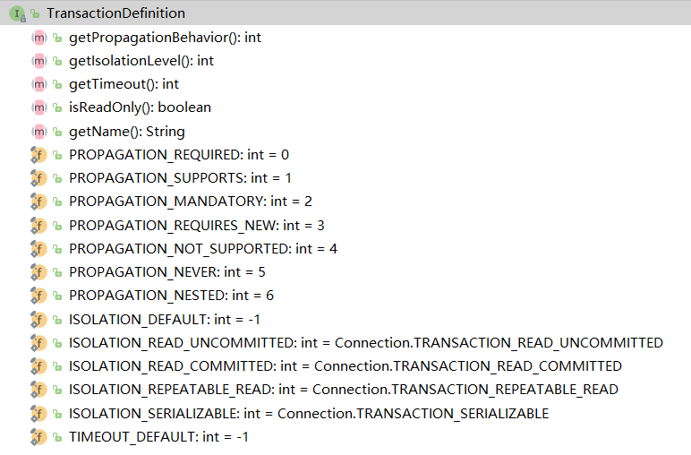

# 事务

## JDBC事务

**何为数据库事务？**

​	事务就是一系列操作组成的工作单元，该工作单元内的操作是不可分割的，要么执行所有操作，要么所有操作都不做。这就是事务。事务必须满足ACID特性，缺一不可

+ 原子性(Atomicity)：事务时不可分割的最小单元，事务内的操作要么全做，要么不做。

+ 一致性(Consistency)：在事务执行前数据库的数据处于正确的状态，而事务执行完成之后数据库的数据依然处于正确状态，即数据完整约束没有被破坏，如A给B转账，不论转账是否成功，转账之后A和B的账号总额和转账之前是相同的。

+ 隔离性(Isolation)：当多个事务处于并发访问一个数据库资源时候，事务之间相互影响程度，不同的隔离级别决定了各个事务对数据资源访问的不同行为。

+ 持久性(Durability)：事务一旦执行成功，它对数据库的数据改变是不可逆的。


**数据库并发问题**

| 并发问题类型   |                       产生的原因和效果                       |
| :------------- | :----------------------------------------------------------: |
| 脏读           | 第二个事务查询到了第一个事务未提交的更新数据，第二个事务根据该数据执行，但是第一个事务回滚，第二个事务操作脏数据。 |
| 第一类丢失更新 | 两个事务更新相同的数据，如果一个事务提交，另一个事务回滚，第一个事务的更新会被回滚 |
| 第二类丢失更新 | 多个事务同时读取相同的数据，并完成各自的事务提交，导致最后一个事务提交会覆盖前面所有的事务对于数据的改变。 |
| 不可重复读     | 一个事务查询到了另外一个事务已经修改的数据，导致多次查询的数据不一致 |
| 幻读（虚读）   | 一个事务查询到了另外一个事务已经提交（新增）的新数据，导致多次查询的数据不一致 |

为了解决这些并发问题，需要通过数据库的隔离级别来解决，在标准的SQL规范中定义了四种隔离级别：

READ UNCOMMITED < READ COMMITTED < REPEATABLE READ < SERIALIZABLE


| 隔离级别        | 脏读 | 不可重复读 | 幻读 | 第一类丢失更新 | 第二类丢失更新 |
| --------------- | ---- | ---------- | ---- | -------------- | :------------: |
| READ UNCOMMITED | √    | √          | √    | x              |       √        |
| READ COMMITTED  | x    | √          | √    | √              |       √        |
| REPEATABLE READ | x    | x          | √    | √              |       √        |
| SERIALIZABLE    | x    | x          | x    | x              |       x        |

Oracle：支持只支持READ COMMITTED和SERIALIZABLE，默认支持的隔离级别READ COMMITTED

MySQL：四种隔离级别都支持，默认支持的隔离级别是REPEATABLE  READ。默认情况下MySQL不会出现幻读，除非select * from tbl_name lock in share mode。MySQL中锁基于索引机制，也不会出现第一类丢失更新。

**如何选择数据库的隔离级别？**

隔离级别越高，数据库事务的并发执行性能越差，能处理的操作越少。因此在实际项目的开发中为了考虑并发性能一般选用READ COMMITTED，他能避免脏读和丢失更新，尽管无法避免不可重复度和幻读，更多情况下我们是选用悲观锁或者乐观锁机制来解决问题的。

## Spring对于事务支持

## 事务的分类

事务的分类

本地事务：就是普通的事务，能保证单台数据库上的操作ACID，并限定在一台数据库上

分布式事务：涉及多个数据库事务，即跨越多台同类或者异类数据库事务（由每台数据库的本地事务组成的），分布式事务旨在保证这些本地的所有操作的ACID，使得事务可以跨越多台数据库


JDBC事务和JTA事务

JDBC事务：就是数据库事务类型中的本地事务，通过Connection对象的控制来管理事务

JTA事务：JTA（Java Transaction API)，是java EE数据库事务规范，JTA只是提供了事务管理的接口，由应用程序服务器厂商来提供实现，JTA事务比JDBC更强大，支持分布式事务

声明式事务：通过注解或者XML配置来管理事务

编程式事务：通过写代码的方式来管理事务


## spring事务相关API

JDBC/MyBatis：使用的事务管理器是DataSourceTranscationManager

Hibernate：使用的事务管理器是HibernateTranscationManager


TransactionDefinition：封装事务的隔离级别和超时时间等属性，比如：是否只读事务和事务的隔离级别和传播规则等事务属性



TransactionStatus：封装了事务的运行状态。比如是否已经开启事务，是否已经提交事件，设置当前事务为rollback-only等

```java
public interface TransactionStatus extends SavepointManager {
    boolean isNewTransaction();
    boolean hasSavepoint();
    void setRollbackOnly();
    boolean isRollbackOnly();
    void flush();
    boolean isCompleted();

}

```


PlatformTransactionManager：根据TransactionDefinition提供的事务属性配置信息，创建事务

```java
public interface PlatformTransactionManager {

   TransactionStatus getTransaction(TransactionDefinition definition) throws 		TransactionException;

    void commit(TransactionStatus status) throws TransactionException;

    void rollback(TransactionStatus status) throws TransactionException;
}
```


## 事务的传播规则

情景：A类方法调用B类方法，被调用者B的方法都有事务支持，调用者A类方法是否有事务支持会影响B类方法的事务。比如：如果A类方法中有事务支持，那么B类方法是和A类公用一个事务（B的结果比如回滚异常对A的结果有影响），还是新开一个事务（A方法中的事务和B方法中的事务是两个不同的事务，B中方法的执行结果对A没有影响）。如果A类方法中没有事务支持，那么B类方法是和A方法不以事务方式运行还是新开一个事务。这就是事务传播属性的意义。事务的传播属性大致分为三类

+ 支持当前(调用者A)事务：被调用者和调用者公用一个事务，被调用者是否有事务取决于调用者是否有事务支持。
+ 不支持当前（调用者A）事务
+ 其他事务


在一个事务方法中调用了其他的事务方法，此时事务应该如何传递，应该按照什么规则传递（按照那个事务方法的事务规则）。Spring中有一下七种传播规则

| 传播性                      | 值   | 描述                                                         |
| --------------------------- | ---- | ------------------------------------------------------------ |
| `PROPAGATION_REQUIRED`      | 0    | 支持当前事务，如果没有就新建事务                             |
| `PROPAGATION_SUPPORTS`      | 1    | 支持当前事务，如果没有就不以事务的方式运行                   |
| `PROPAGATION_MANDATORY`     | 2    | 支持当前事务，如果当前没事务就抛异常                         |
| `PROPAGATION_REQUIRES_NEW`  | 3    | 无论当前是否有事务，都会新起一个事务                         |
| `PROPAGATION_NOT_SUPPORTED` | 4    | 不支持事务，如果当前存在事务，就将此事务挂起不以事务方式运   行。**无论调用者是否有事务，被调用者都不以事务的方法运行** |
| `PROPAGATION_NEVER`         | 5    | 不支持事务，如果有事务就抛异常                               |
| `PROPAGATION_NESTED`        | 6    | 如果当前存在事务，则在嵌套事务内执行。嵌套事务的本质就是**外层会影响内层，内层不影响外层**。而`REQUIRES_NEW`则是**互不影响**。 |


可以把上述的七种的规则划分为以下三类

**情况一：支持当前事务**

+ **PROPAGATION_REQUIRED = 0**

必须存在一个事务，**如果调用者方法当前存在一个事务，则被调用者方法加入到该事务中，否则被调用者新建一个新事物，开发中经常使用。**

+ PROPAGATION_SUPPORTS = 1

支持当前事务，如果当前存在事务，则使用该事务，否则以非事务形式运行。也就是说被调用者是否有事务，完全依赖于调用者，调用者有事务则有事务，调用者没事务则没事务。

+ PROPAGATION_MANDATORY = 2

必须要存在事务，如果调用者当前存在事务，就使用该事务，否则就抛出非法事务状态异常(IllegalTransactionStatusException)

**支持事务的意思就是被调用者如果有事务就和调用者共用一个事务，调用者和被调用者任何一方的执行成功与否（回滚?抛出异常？....）都会影响到另外一方的执行结果。**

**情况二：不遵从当前事务**

+ **PROPAGATION_REQUIRES_NEW = 3**

此传播属性下，**无论调用者是否有事务，被调用者都会新建一个事务。**开发中也比较常见，

> 注意
>
> PROPAGATION_REQUIRES_NEW 和PROPAGATION_REQUIRED 的区别，PROPAGATION_REQUIRED 调用者方法有事务的时候，被调用者会加入调用者的事务中，此时调用者方法和被调用者共用一个事务，也就是说被调用者方法执行成功与否直接关系调用者方法的执行结果。而PROPAGATION_REQUIRES_NEW 被调用者方法会创建出一个新事物，此时调用者方法的事务和被调用者方法是两个事务，也就是说被调用者方法的成功与否不关系调用者方法的结果。

