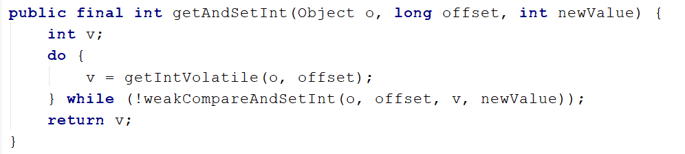

# 任何牛逼的人在成功之前一定有一段苦逼的岁月，但请你一定要像傻逼一样坚持，最后才能够装逼


## 公平锁和非公平锁

公平锁：多个线程按照申请锁的顺序来获取锁，类似于队列先进先出

非公平锁：是指多个线程获取锁的顺序并不是按照申请锁的顺序，又可能后申请的线程比先申请的线程优先获取锁，在高并发的情况下，有可能会造成优先级反转或者是饥饿现象。


Java ReentrantLock而言可以通过构造函数指定该所是否是公平锁，**ReentrantLock默认是非公平可重入锁**，非公平锁的优点在于吞吐量比公平锁大，对于Synchronized而言也是一种非公平锁。


## 可重入锁（递归锁）

可重入锁又名递归锁：指的是同一个线程外层函数获得锁之后，内层递归函数仍然能够获得该锁，同一个线程在外层方法获取锁的时候，在进入内层方法会自动获取锁。也就是说，**线程可以进入任何一个它已经拥有的锁所同步着的代码块。**

**ReentrantLock和synchronized 就是一个典型的可重入锁，可重入锁最大的作用就是避免死锁。**

```java
public synchronized void fun1(){
    fun2();
}

public synchronized void fun2(){
    
}
```


验证synchronized是一个可重入锁

```java
class Phone{
    public synchronized void sendEmail(){
        System.out.println(Thread.currentThread().getName()+"  发送Email");
        sendQQ();
    }
    public synchronized void sendQQ(){
        System.out.println(Thread.currentThread().getName()+"  发送QQ");
    }
}
public class RecursionLock {

    public static void main(String[] args) {
        Phone phone = new Phone();
        new Thread(()->{
            phone.sendEmail();
          },"AAA").start();

          new Thread(()->{
               phone.sendEmail();
          },"BBB").start();
    }
}
AAA  发送Email
AAA  发送QQ
BBB  发送Email
BBB  发送QQ
```

验证ReentrantLock是一个可重入锁

```java
class Phone{
    private Lock lock = new ReentrantLock();
    public  void sendEmail(){
        lock.lock();
        try {
            System.out.println(Thread.currentThread().getName()+"  发送Email");
            sendQQ();
        } finally {
            lock.unlock();
        }

    }
    
    public  void sendQQ(){
        lock.lock();
        try {
            System.out.println(Thread.currentThread().getName()+"  发送QQ");
        } finally {
            lock.unlock();
        }
    }
}
public class RecursionLock {

    public static void main(String[] args) {
        Phone phone = new Phone();
        new Thread(()->{
            phone.sendEmail();
          },"AAA").start();

          new Thread(()->{
               phone.sendEmail();
          },"BBB").start();
    }
}
AAA  发送Email
AAA  发送QQ
BBB  发送Email
BBB  发送QQ

```


## 自旋锁

自旋锁（spinlock）：尝试获取锁的线程不会立刻阻塞，而是采用循环的方式去尝试获取锁，这样的好处是减少了线程上下文切换的消耗，缺点是会循环消耗CPU




自旋锁的好处：循环比较知道成功为止，没有类似于wait的阻塞

通过CAS操作完成自旋锁，A线程先进来调用myLock方法自己持有的锁5秒钟，B随后进来后发现当前有线程持有锁，不是null，所以只能通过自旋等待，直到A释放锁后B随后抢到。

```java
//手写一个自旋锁
public class SpinLock {

    //引用变量构造函数没有传入实例对象默认是null
    private AtomicReference<Thread> atomicReference = new AtomicReference<>();

    public void myLock(){
        Thread thread = Thread.currentThread();
        System.out.println(thread.currentThread().getName()+"  comming in 0(n_n)0");
        while (!atomicReference.compareAndSet(null,thread)){

        }
    }

    public void myUnlock(){
        Thread thread = Thread.currentThread();
        atomicReference.compareAndSet(thread,null);
        System.out.println(Thread.currentThread().getName()+"  invoked myUnlock!!!");
    }

    public static void main(String[] args) {
        SpinLock spinLock = new SpinLock();
          
          new Thread(()->{
              spinLock.myLock();
              try{
                  TimeUnit.SECONDS.sleep(5);
              } catch (Exception e) {
                  e.printStackTrace();
              }

               spinLock.myUnlock();
          },"AAA").start();

          try{
              TimeUnit.SECONDS.sleep(1);
          } catch (Exception e) {
              e.printStackTrace();
          }

            new Thread(()->{
                spinLock.myLock();
                 spinLock.myUnlock();
            },"BBB").start();
    }


}
AAA  comming in 0(n_n)0
BBB  comming in 0(n_n)0
AAA  invoked myUnlock!!!
BBB  invoked myUnlock!!!

```


## 读写锁

独占锁（写锁）共享锁（读锁）互斥锁 

多个线程同时读取一个资源类的时候没有任何问题，为了满足并发量，读取共享操作应该可以同时进行

但是如果有一个线程想去写共享类，就不应该有其他线程可以对该资源进行读或者写

总之：写锁是独占锁，不允许其他任何线程读或者写该资源。读锁是共享的，可以允许所有的线程读取该资源，不允许写该资源。

| 操作  | 结果 |
| ----- | ---- |
| 读-读 | 共享 |
| 读-写 | 阻塞 |
| 写-写 | 阻塞 |


