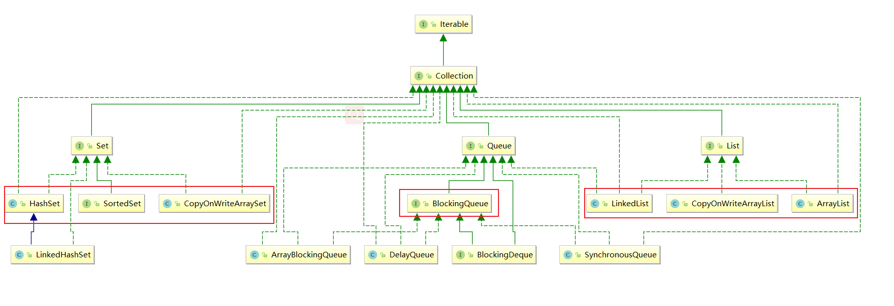
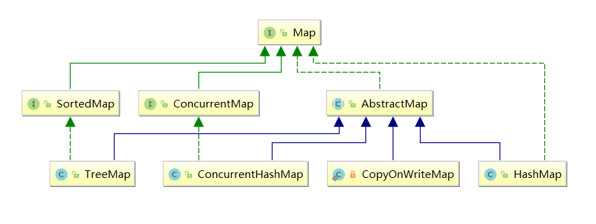

# 写时复制


ArrayList线程不安全举例


```java
 List<String> list = new CopyOnWriteArrayList<>();
        for (int i = 0; i < 20; i++) {
            new Thread(()->{
                list.add(UUID.randomUUID().toString().substring(0,8));
                System.out.println(list);
            }).start();
        }
```


以上代码可能造成java.util.ConcurrentModificationException：一个线程正在写入数据的时候，另外一个线程争抢相同的资源写入数据。说明了在传统的java集合中读和写是不能同时进行的。解决方案采用读写分离的思想，或者采用juc下提供的集合安全类。CopyOnWrite容器即写时复制的容器。通俗的理解是当我们往一个容器添加元素的时候，不直接往当前容器添加，而是先将当前容器进行Copy，复制出一个新的容器，然后新的容器里添加元素，添加完元素之后，再将原容器的引用指向新的容器。这样做的好处是我们可以对CopyOnWrite容器进行并发的读，而不需要加锁，因为当前容器不会添加任何元素。所以CopyOnWrite容器也是一种读写分离的思想，读和写不同的容器。


| 线程不安全 | ArrayList                      | HashSet                       | HashMap                       |
| ---------- | ------------------------------ | :---------------------------- | ----------------------------- |
| 线程安全   | CopyOnWriteArrayList           | CopyOnWriteArraySet           | ConcurrentHashMap             |
| 线程安全   | Collections.synchronizedList() | Collections.synchronizedSet() | Collections.synchronizedMap() |





Java 5.0在java.util.concurrent包中提供了多种并发容器类来改进同步容器的性能。ConcurrentHashMap同步容器类是Java 5增加的一个线程安全的哈希表。对与多线程的操作，介于HashMap与Hashtable之间。内部采用“锁分段”机制替代Hashtable的独占锁。进而提高性能。此包还提供了设计用于多线程上下文中的Collection实现:ConcurrentHashMap、ConcurrentSkipListMap、 ConcurrentSkipListSet、CopyOnWriteArrayList和CopyOnWriteArraySet。当期望许多线程访问一.个给定collection时，ConcurrentHashMap 通常优于同步的HashMap，ConcurrentSkipListMap通常优于同步的TreeMap。当期望的读数和遍历远远大于列表的更新数时，CopyOnWriteArrayList 优于同步的ArrayList。


```java
public boolean add(E e){
    final ReentrantLock lock = this.lock;
    lock.lock();
    try{
        Object[] elements = getArray();//获取原来的容器
        int len = elements.length;//原来容器的长度
        
        //将原来容器中的值拷贝到新的容器，长度+1
        Obejct[] newElements = Arrays.copyOf(elements,len+1);
        newElements[len] = e;//向新容器中添加新增的元素
        setArray(newElements);//将容器引用指向新的容器
        return true;
    }finally{
        lock.unlock();
    }
               
}
```

源码解析：CopyOnWrite容器即写时复制的容器，向一个容器添加元素的时候，**不直接往当前容器Object[]添加，而是先将当前容器Object[]进行copy，复制出一个新的容器Object[] new Elements，然后向新的容器Object[] newElements里边添加元素，所有的add都是需要再新增的容器中添加就避免了并发修改异常**，添加元素之后再将原容器的引用指向新的容器（setArray(new Elements)），这样做的好处是可以对CopyOnWrite容器进行并发的读，而不需要加锁，因为当前容器不会添加任何新的元素。所以CopyOnWrite容器也是一种读写分离的思想，读和写不同的容器。


## Copy-on-write的应用场景

**CopyOnWrite并发容器用于读多写少的并发场景。**比如白名单，黑名单，商品类目的访问和更新场景，假如我们有一个搜索网站，用户在这个网站的搜索框中，输入关键字搜索内容，但是某些关键字不允许被搜索。这些不能被搜索的关键字会被放在一个黑名单当中，黑名单每天晚上更新一次。当用户搜索时，会检查当前关键字在不在黑名单当中，如果在，则提示不能搜索。实现代码如下：

```java
import java.util.Map;
 
import com.ifeve.book.forkjoin.CopyOnWriteMap;
 
/**
 * 黑名单服务
 *
 * @author fangtengfei
 *
 */
public class BlackListServiceImpl {
 
    private static CopyOnWriteMap<String, Boolean> blackListMap = new CopyOnWriteMap<String, Boolean>(
            1000);
 
    public static boolean isBlackList(String id) {
        return blackListMap.get(id) == null ? false : true;
    }
 
    public static void addBlackList(String id) {
        blackListMap.put(id, Boolean.TRUE);
    }
 
    /**
     * 批量添加黑名单
     *
     * @param ids
     */
    public static void addBlackList(Map<String,Boolean> ids) {
        blackListMap.putAll(ids);
    }
 
}
```


## Copy-on-write的缺点


CopyOnWrite容器有很多优点，但是同时也存在两个问题，即内存占用问题和数据一致性问题。所以在开发的时候需要注意一下。

内存占用问题。**因为CopyOnWrite的写时复制机制，所以在进行写操作的时候，内存里会同时驻扎两个对象的内存，旧的对象和新写入的对象（注意:在复制的时候只是复制容器里的引用，只是在写的时候会创建新对象添加到新容器里，而旧容器的对象还在使用，所以有两份对象内存）。**如果这些对象占用的内存比较大，比如说200M左右，那么再写入100M数据进去，内存就会占用300M，那么这个时候很有可能造成频繁的Yong GC和Full GC。之前我们系统中使用了一个服务由于每晚使用CopyOnWrite机制更新大对象，造成了每晚15秒的Full GC，应用响应时间也随之变长。

针对内存占用问题，可以通过压缩容器中的元素的方法来减少大对象的内存消耗，比如，如果元素全是10进制的数字，可以考虑把它压缩成36进制或64进制。或者不使用CopyOnWrite容器，而使用其他的并发容器，如ConcurrentHashMap。

**数据一致性问题。CopyOnWrite容器只能保证数据的最终一致性，不能保证数据的实时一致性。**所以如果你希望写入的的数据，马上能读到，请不要使用CopyOnWrite容器。


## 总结

集合类(ArrayList、HashMap)上的常用操作是：向集合中添加元素、删除元素、遍历集合中的元素然后进行某种操作。当多个线程并发地对一个集合对象执行这些操作时就会引发ConcurrentModificationException，比如线程A在for-each中遍历ArrayList，而线程B同时又在删除ArrayList中的元素，就可能会抛出ConcurrentModificationException，可以在线程A遍历ArrayList时加锁，但由于遍历操作是一种常见的操作，加锁之后会影响程序的性能，因此for-each遍历选择了不对ArrayList加锁而是当有多个线程修改ArrayList时抛出ConcurrentModificationException，因此，这是一种设计上的权衡。为了应对多线程并发修改这种情况，一种策略就是本文的主题“写时复制”机制；另一种策略是：线程安全的容器类：ArrayList--->CopyOnWriteArrayListHashMap--->ConcurrentHashMap。而ConcurrentHashMap并不是从“复制”这个角度来应对多线程并发修改，而是引入了分段锁(JDK7)；CAS、锁(JDK11)解决多线程并发修改的问题。


回顾读写锁：读读共享、其他都互斥(写写互斥、读写互斥、写读互斥)，使用CopyOnWrite实现读写锁规则的升级：**读取是完全不用加锁的，并且更厉害的是写入也不会阻塞读取操作。只有写入和写入之间需要进行同步等待。也就是说我们除了写写互斥之外其余的全部共享。这就是写时复制的优势，体现了读写分离的思想。**