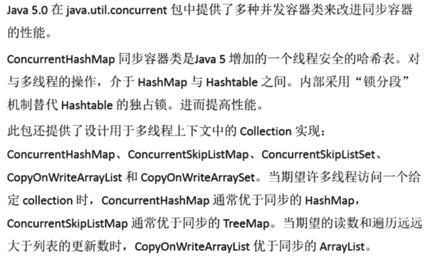

```java
@Getter
@Setter
@NoArgsConstructor
@AllArgsConstructor
class Person{
    private String name;
    private int id;
}

public class TestTransferValue {
    public void changeValue1(int age){
        age =30;
    }

    public void changeValue2(Person person){
        person.setName("xxx");

    }

    public void changeValue3(String str){
        str = "xxx";
    }

    public static void main(String[] args) {
        TestTransferValue test = new TestTransferValue();
        int age = 20;
        test.changeValue1(age);
        System.out.println("age==="+age);

        Person p = new Person("abc",10);
        test.changeValue2(p);
        System.out.println("personName===="+p.getName());

        String str = "abc";
        test.changeValue3(str);
        System.out.println("str==="+str);//易错点

    }
}

age===20
personName====xxx
str===abc
```


| 线程不安全 | ArrayList                      | HashSet                       | HashMap                       |
| ---------- | ------------------------------ | :---------------------------- | ----------------------------- |
| 线程安全   | CopyOnWriteArrayList           | CopyOnWriteArraySet           | ConcurrentHashMap             |
| 线程安全   | Collections.synchronizedList() | Collections.synchronizedSet() | Collections.synchronizedMap() |




ArrayList线程不安全举例

```java
 List<String> list = new CopyOnWriteArrayList<>();
        for (int i = 0; i < 20; i++) {
            new Thread(()->{
                list.add(UUID.randomUUID().toString().substring(0,8));
                System.out.println(list);
            }).start();
        }
```


以上代码可能造成java.util.ConcurrentModificationException：一个线程正在写入数据的时候，另外一个线程争抢相同的资源写入数据


源码解析：CopyOnWrite容器即写时复制的容器，向一个容器添加元素的时候，**不直接往当前容器Object[]添加，而是先将当前容器Object[]进行copy，复制出一个新的容器Object[] new Elements，然后向新的容器Object[] newElements里边添加元素，所有的add都是需要再新增的容器中添加就避免了并发修改异常**，添加元素之后再将原容器的引用指向新的容器（setArray(new Elements)），这样做的好处是可以对CopyOnWrite容器进行并发的读，而不需要加锁，因为当前容器不会添加任何新的元素。所以CopyOnWrite容器也是一种读写分离的思想，读和写不同的容器。

```java
public boolean add(E e){
    final ReentrantLock lock = this.lock;
    lock.lock();
    try{
        Object[] elements = getArray();//获取原来的容器
        int len = elements.length;//原来容器的长度
        Obejct[] newElements = Arrays.copyOf(elements,len+1);//将原来容器中的值拷贝到新的容器，长度+1
        newElements[len] = e;//向新容器中添加新增的元素
        setArray(newElements);//将容器引用指向新的容器
        return true;
    }finally{
        lock.unlock();
    }
               
}
```


### 八锁演示

普通同步方法的同步监视器（锁）是当前对象，静态同步方法的同步监视器是当前类的字节码文件（Class），对于同步代码块来说同步监视器就是括号里边配置的对象。有相同同步监视器的代码部分都只能串行执行，只有等待上一个线程释放同步监视器对象之后才能执行。不同同步监视器的代码部分是可以并行执行的。


CASE

```java
class Phone{
    public  synchronized void sendEmail(){
        try{
            TimeUnit.SECONDS.sleep(4);
        } catch (Exception e) {
            e.printStackTrace();
        }

        System.out.println(Thread.currentThread().getName()+"发送邮件....");
    }

    public  synchronized void sendMSG(){
        System.out.println(Thread.currentThread().getName()+"发送短信..");
    }
}

public class Locks {
    public static void main(String[] args) {
        Phone phone = new Phone();
        new Thread(()->{
            phone.sendEmail();
        },"AAA").start();

        try{
            TimeUnit.SECONDS.sleep(1);
        } catch (Exception e) {
            e.printStackTrace();
        }

        new Thread(()->{
            phone.sendMSG();
        },"BBB").start();

    }
}

AAA发送邮件....
BBB发送短信..
```

解析：sendEmail和sendMSG同步方法的同步监视器对象都是当前的phone，相当于这两个方法再同一段同步代码块中，所以AAA线程先访问sendEmail完毕之后BBB线程才能访问sendMSG方法

CASE1

```java
class Phone{
    public synchronized void sendEmail(){
        try{
            TimeUnit.SECONDS.sleep(4);
        } catch (Exception e) {
            e.printStackTrace();
        }

        System.out.println(Thread.currentThread().getName()+"发送邮件....");
    }

    public synchronized void sendMSG(){
        System.out.println(Thread.currentThread().getName()+"发送短信..");
    }

    public void sayHello(){
        System.out.println(Thread.currentThread().getName()+"  hello hello ");
    }
}

public class Locks {
    public static void main(String[] args) {
        Phone phone = new Phone();
        new Thread(()->{
            phone.sendEmail();
        },"AAA").start();

        try{
            TimeUnit.SECONDS.sleep(1);
        } catch (Exception e) {
            e.printStackTrace();
        }

        new Thread(()->{
            phone.sayHello();
        },"BBB").start();

    }
}
BBB  hello hello 
AAA发送邮件....
   
```

解析：线程B访问的sayHello方法没有上锁，没有暂停所以限制性完成。


CASE2

```java
class Phone{
    public synchronized void sendEmail(){
        try{
            TimeUnit.SECONDS.sleep(4);
        } catch (Exception e) {
            e.printStackTrace();
        }

        System.out.println(Thread.currentThread().getName()+"发送邮件....");
    }

    public synchronized void sendMSG(){
        System.out.println(Thread.currentThread().getName()+"发送短信..");
    }
}

public class Locks {
    public static void main(String[] args) {
        Phone phone = new Phone();
        new Thread(()->{
            phone.sendEmail();
        },"AAA").start();

        try{
            TimeUnit.SECONDS.sleep(1);
        } catch (Exception e) {
            e.printStackTrace();
        }

        new Thread(()->{
            phone.sendMSG();
        },"BBB").start();

    }
}
AAA发送邮件....
BBB发送短信..
```


CASE3

```
class Phone{
    public synchronized void sendEmail(){
        try{
            TimeUnit.SECONDS.sleep(4);
        } catch (Exception e) {
            e.printStackTrace();
        }

        System.out.println(Thread.currentThread().getName()+"发送邮件....");
    }

    public synchronized void sendMSG(){
        System.out.println(Thread.currentThread().getName()+"发送短信..");
    }

    public void sayHello(){
        System.out.println(Thread.currentThread().getName()+"  hello hello ");
    }
}

public class Locks {
    public static void main(String[] args) {
        Phone phone = new Phone();
        Phone phone1 =  new Phone();
        new Thread(()->{
            phone.sendEmail();
        },"AAA").start();

        try{
            TimeUnit.SECONDS.sleep(1);
        } catch (Exception e) {
            e.printStackTrace();
        }

        new Thread(()->{
            phone1.sendMSG();
        },"BBB").start();

    }
}

BBB发送短信..
AAA发送邮件....
```

解析：BBB访问的的同步方法sendMSG的同步监视器对象是phone1，AAA是phone，两者可以并发执行没有影响，AAA有暂停，所以BBB先访问完毕。

CASE4

```java
class Phone{
    public static  synchronized void sendEmail(){
        try{
            TimeUnit.SECONDS.sleep(4);
        } catch (Exception e) {
            e.printStackTrace();
        }

        System.out.println(Thread.currentThread().getName()+"发送邮件....");
    }

    public static synchronized void sendMSG(){
        System.out.println(Thread.currentThread().getName()+"发送短信..");
    }

    public void sayHello(){
        System.out.println(Thread.currentThread().getName()+"  hello hello ");
    }
}

public class Locks {
    public static void main(String[] args) {
        Phone phone = new Phone();
        Phone phone1 =  new Phone();
        new Thread(()->{
            phone.sendEmail();
        },"AAA").start();

        try{
            TimeUnit.SECONDS.sleep(1);
        } catch (Exception e) {
            e.printStackTrace();
        }

        new Thread(()->{
            phone1.sendMSG();
        },"BBB").start();

    }
}
AAA发送邮件....
BBB发送短信..
```

CASE5

```java
class Phone{
    public static  synchronized void sendEmail(){
        try{
            TimeUnit.SECONDS.sleep(4);
        } catch (Exception e) {
            e.printStackTrace();
        }

        System.out.println(Thread.currentThread().getName()+"发送邮件....");
    }

    public static synchronized void sendMSG(){
        System.out.println(Thread.currentThread().getName()+"发送短信..");
    }

    public void sayHello(){
        System.out.println(Thread.currentThread().getName()+"  hello hello ");
    }
}

public class Locks {
    public static void main(String[] args) {
        Phone phone = new Phone();
        //Phone phone1 =  new Phone();
        new Thread(()->{
            phone.sendEmail();
        },"AAA").start();

        try{
            TimeUnit.SECONDS.sleep(1);
        } catch (Exception e) {
            e.printStackTrace();
        }

        new Thread(()->{
            phone.sendMSG();
        },"BBB").start();

    }
}
AAA发送邮件....
BBB发送短信..
```

CASE6

```java
class Phone{
    public static  synchronized void sendEmail(){
        try{
            TimeUnit.SECONDS.sleep(4);
        } catch (Exception e) {
            e.printStackTrace();
        }

        System.out.println(Thread.currentThread().getName()+"发送邮件....");
    }

    public  synchronized void sendMSG(){
        System.out.println(Thread.currentThread().getName()+"发送短信..");
    }

    public void sayHello(){
        System.out.println(Thread.currentThread().getName()+"  hello hello ");
    }
}

public class Locks {
    public static void main(String[] args) {
        Phone phone = new Phone();
        //Phone phone1 =  new Phone();
        new Thread(()->{
            phone.sendEmail();
        },"AAA").start();

        try{
            TimeUnit.SECONDS.sleep(1);
        } catch (Exception e) {
            e.printStackTrace();
        }

        new Thread(()->{
            phone.sendMSG();
        },"BBB").start();

    }
}
BBB发送短信..
AAA发送邮件...
```

CASE7

```java
class Phone{
    public static  synchronized void sendEmail(){
        try{
            TimeUnit.SECONDS.sleep(4);
        } catch (Exception e) {
            e.printStackTrace();
        }

        System.out.println(Thread.currentThread().getName()+"发送邮件....");
    }

    public  synchronized void sendMSG(){
        System.out.println(Thread.currentThread().getName()+"发送短信..");
    }

    public void sayHello(){
        System.out.println(Thread.currentThread().getName()+"  hello hello ");
    }
}

public class Locks {
    public static void main(String[] args) {
        Phone phone = new Phone();
        Phone phone1 =  new Phone();
        new Thread(()->{
            phone.sendEmail();
        },"AAA").start();

        try{
            TimeUnit.SECONDS.sleep(1);
        } catch (Exception e) {
            e.printStackTrace();
        }

        new Thread(()->{
            phone1.sendMSG();
        },"BBB").start();

    }
}
BBB发送短信..
AAA发送邮件....
```


### 线程通信


生产者和消费者案例是多线程通信中一个经典案例。现在Buffer里边有初始值为0的产品，要求生产者没生产一个产品，消费者就消费一个产品。这是一个简单的案例，使用多线程的等待唤醒机制就能轻松解决。

生产者消费者案例1

```java
class Buffer{
    private int num;
    boolean flag = true;

    public void increase(){
        synchronized (this){
            if(!flag){
                try {
                    this.wait();
                } catch (Exception e) {
                    e.printStackTrace();
                }

            }

            num++;
            flag = false;
            System.out.println(Thread.currentThread().getName()+" : "+num);
            this.notifyAll();

        }

    }
    public void decrease(){
       synchronized (this){
           if(flag){
               try {
                   this.wait();
               } catch (InterruptedException e) {
                   e.printStackTrace();
               }
           }
               num--;
               flag = true;
               System.out.println(Thread.currentThread().getName()+" : "+num);
               this.notifyAll();


       }
    }

}

public class ThreadCommunication {
    public static void main(String[] args) {
        Buffer buffer = new Buffer();
        new Thread(()->{
            for (int i = 0; i < 10; i++) {
                buffer.increase();
            }

          },"AAA").start();
          new Thread(()->{
              for (int i = 0; i < 10; i++) {
                  buffer.decrease();
              }

           },"BBB").start();
    }
}
AAA : 1
BBB : 0
AAA : 1
BBB : 0
AAA : 1
BBB : 0
AAA : 1
BBB : 0
AAA : 1
BBB : 0

```

以上代码在只有一个生产者一个消费者的两个线程中没有什么问题，但是生产者消费者一旦多起来就可能产生问题。现在要求两个生产者生产，两个消费者消费。这样就可能产生虚假唤醒的问题。

### 线程的虚假唤醒问题

```java
class Buffer{
    private int num;
    boolean flag = true;

    public void increase(){
        synchronized (this){
            if(!flag){
                try {
                    this.wait();
                } catch (Exception e) {
                    e.printStackTrace();
                }

            }

            num++;
            flag = false;
            System.out.println(Thread.currentThread().getName()+" : "+num);
            this.notifyAll();

        }

    }
    public void decrease(){
       synchronized (this){
           if(flag){
               try {
                   this.wait();
               } catch (InterruptedException e) {
                   e.printStackTrace();
               }
           }
               num--;
               flag = true;
               System.out.println(Thread.currentThread().getName()+" : "+num);
               this.notifyAll();


       }
    }

}

public class ThreadCommunication {
    public static void main(String[] args) {
        Buffer buffer = new Buffer();
        new Thread(()->{
            for (int i = 0; i < 5; i++) {
                buffer.increase();
            }

          },"AAA").start();
          new Thread(()->{
              for (int i = 0; i < 5; i++) {
                  buffer.decrease();
              }

           },"BBB").start();

           new Thread(()->{
               for (int i = 0; i < 5; i++) {
                   buffer.increase();

               }
            },"CCC").start();
           new Thread(()->{
               for (int i = 0; i < 5; i++) {
                   buffer.decrease();

               }
            },"DDD").start();
    }
}

AAA : 1
BBB : 0
AAA : 1
BBB : 0
AAA : 1
BBB : 0
AAA : 1
BBB : 0
CCC : 1
AAA : 2
CCC : 3
DDD : 2
BBB : 1
DDD : 0
CCC : 1
DDD : 0
CCC : 1
DDD : 0
CCC : 1
DDD : 0
```

出现问题CCC : 1  AAA : 2  CCC : 3这就是虚假唤醒问题  

虚假唤醒产生的原因：在上面的Demo中有AC两个生产者和BD两个消费者。无论是生产者还是消费者每次生产或者消费一个产品之后都要唤醒所有的阻塞线程再次竞争共享资源Buffer。如果wait前面的判断条件用的是if就可能存在下面一种情景：生产者已经生产一件产品(num = 1)，flag=flase。此时就会唤醒所有的ABCD四个线程，

1. 生产者A获得Buffer的锁对象，进入判断发现flag==false就会阻塞。

2. 生产者C获得Buffer的锁对象，进入判断发现flag==false对象也会阻塞。

3. 消费者B获得Buffer的锁对象，进入判断flag=flase，正常执行完毕唤醒所有的阻塞线程，将flag设置ture

4. 生产者A获得Buffer的锁对象，由于阻塞的时候已经用if判断过flag，线程被唤醒的时候直接从阻塞的地方开始执行，唤醒所有阻塞线程，将flag设置flase

5. 生产者A获得Buffer的锁对象，由于阻塞的时候已经用if判断过flag，**唤醒时候从阻塞地方开始执行。虽然flag为false，但是不会重新判断不会导致当前线程阻塞。**导致num连续自增两次。

   


从上面可以看出造成虚假唤醒的原因就是阻塞线程被唤醒的时候要从中断地方开始执行，如果用if做wait的判断条件会导致唤醒之后不加判断直接执行导致程序出错。因此解决方案就是使用while替代if作为判断条件。即使是阻塞之后唤醒也要重新判断。官方的API也对这个问题有说明


总结：==多线程使用等待唤醒机制要防止虚假唤醒问题，wait前面的判断条件不能使用if要使用while==


```java
class Buffer{
    private int num;
    boolean flag = true;

    public void increase(){
        synchronized (this){
            //wait的判断条件为了防止虚假唤醒要使用while做判断
            while(!flag){
                try {
                    this.wait();
                } catch (Exception e) {
                    e.printStackTrace();
                }

            }

            num++;
            flag = false;
            System.out.println(Thread.currentThread().getName()+" : "+num);
            this.notifyAll();

        }

    }
    public void decrease(){
       synchronized (this){
           //为了防止虚假唤醒要使用while做判断
           if(flag){
               try {
                   this.wait();
               } catch (InterruptedException e) {
                   e.printStackTrace();
               }
           }
               num--;
               flag = true;
               System.out.println(Thread.currentThread().getName()+" : "+num);
               this.notifyAll();


       }
    }

}

public class ThreadCommunication {
    public static void main(String[] args) {
        Buffer buffer = new Buffer();
        new Thread(()->{
            for (int i = 0; i < 5; i++) {
                buffer.increase();
            }

          },"AAA").start();
          new Thread(()->{
              for (int i = 0; i < 5; i++) {
                  buffer.decrease();
              }

           },"BBB").start();

           new Thread(()->{
               for (int i = 0; i < 5; i++) {
                   buffer.increase();

               }
            },"CCC").start();
           new Thread(()->{
               for (int i = 0; i < 5; i++) {
                   buffer.decrease();

               }
            },"DDD").start();
    }
}
AAA : 1
BBB : 0
AAA : 1
BBB : 0
AAA : 1
BBB : 0
AAA : 1
BBB : 0
AAA : 1
BBB : 0
CCC : 1
DDD : 0
CCC : 1
DDD : 0
CCC : 1
DDD : 0
CCC : 1
DDD : 0
CCC : 1
DDD : 0
```


生产者消费者案例2

```java
public class Threads {
    public static void main(String[] args) {
        Buffer buffer = new Buffer();
        new Thread(() -> {
            while (true) {
                buffer.lock.lock();
                try {
                    while (buffer.flag) {
                        if (buffer.count % 2 == 0) {
                            buffer.push("春哥", "男");
                            buffer.count++;
                        } else {
                            buffer.push("凤姐", "女");
                            buffer.count++;
                        }
                        buffer.flag = false;
                        buffer.condition.signalAll();
                    }
                    buffer.condition.await();
                } catch (Exception e) {
                    e.printStackTrace();
                } finally {
                    buffer.lock.unlock();
                }


            }
        }, "producter1").start();

        new Thread(() -> {
            while (true) {
                buffer.lock.lock();
                try {
                    while (!buffer.flag) {
                        buffer.pop();
                        buffer.flag = true;
                        buffer.condition.signalAll();
                    }
                    buffer.condition.await();
                } catch (Exception e) {
                    e.printStackTrace();
                } finally {
                    buffer.lock.unlock();
                }

            }
        }, "customer1").start();


    }
}

class Buffer {
    private String name;
    private String gender;
    public boolean flag = true;
    public int count = 0;
    public Lock lock = new ReentrantLock(true);
    public Condition condition = lock.newCondition();


    public void push(String name, String gender) {

        this.name = name;
      /*  try {
            Thread.sleep(100);
        } catch (InterruptedException e) {
            e.printStackTrace();
        }*/
        this.gender = gender;
    }

    public void pop() {
        System.out.println(Thread.currentThread().getName() + "===" + name + "->" + gender);
    }
}
```


### 多线程的顺序调度

Condition接口描述了可能会和锁有关联的条件变量。这些变量在用法上和Object.wait访问的隐式监视器类似，但是提供了更加强大功能。需要特别指出的是，单个Lock可能和多个Condition对象关联。为了避免兼容性问题，Condition方法的名称与对应的Object版本中的不同。在Condition对象中，和wait、notify和notifyAll方法对应的分别是await、signal和signalAll。Condition实例实际上被绑定到一个锁。要为特定的Lock实例获取Condition实例，请使用newCondition方法

备注：多线程之间的顺序调度，实现A->B->C

题目：编码实现AA线程打印5次，BB线程打印10次，CC线程打印15次，按照此顺序打印10轮

```java

//AA打印5次，BB打印10次，CC打印15次，按照此顺序打印10轮
class Print{
    int flag = 1;//标志位
    private Lock lock = new ReentrantLock();
    private Condition con1 = lock.newCondition();
    private Condition con2 =  lock.newCondition();
    private Condition con3 = lock.newCondition();

    public void print5(){
        try {
            lock.lock();
            if(flag != 1){
                con1.await();
            }
            for (int i = 0; i < 5; i++) {
                System.out.println(Thread.currentThread().getName()+"  AAA");
            }

            flag = 2;//一定要先设置标志位
            con2.signal();

        } catch (Exception e) {
            e.printStackTrace();
        } finally {
            lock.unlock();
        }
    }

    public void print10(){
        lock.lock();
        try {
            if(flag != 2){
                con2.await();
            }
            for (int i = 0; i < 10; i++) {
                System.out.println(Thread.currentThread().getName()+"  BBB");
            }
            flag = 3;
            con3.signal();

        } catch (Exception e) {
            e.printStackTrace();
        } finally {
            lock.unlock();
        }

    }

    public void print15(){
        try {
            lock.lock();
            if(flag != 3){
                con3.await();
            }
            for (int i = 0; i < 15; i++) {
                System.out.println(Thread.currentThread().getName()+"  CCC");

            }
            flag = 1;
            con1.signal();
        } catch (Exception e) {
            e.printStackTrace();
        } finally {
            lock.unlock();
        }
    }

}
public class ReentrantLockDemo {


    public static void main(String[] args) {
        Print p = new Print();
         new Thread(()->{
             for (int i = 0; i < 10; i++) {
                 p.print5();
             }

          }, String.valueOf(1)).start();
         new Thread(()->{
             for (int i = 0; i < 10; i++) {
                 p.print10();
             }
          }, String.valueOf(2)).start();
         new Thread(()->{
             for (int i = 0; i < 10; i++) {
                 p.print15();
             }
          }, String.valueOf(3)).start();
    }


}

```


```java

```


