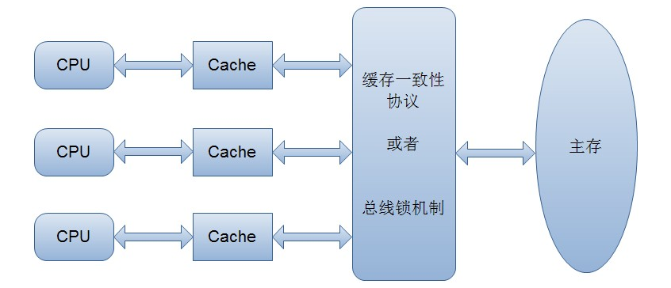
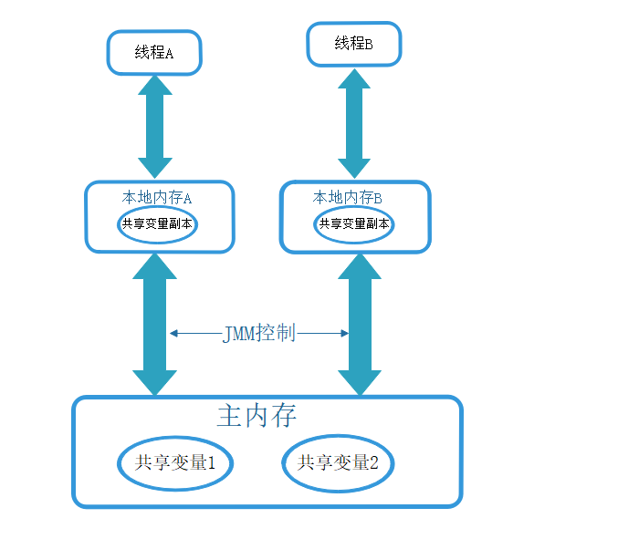
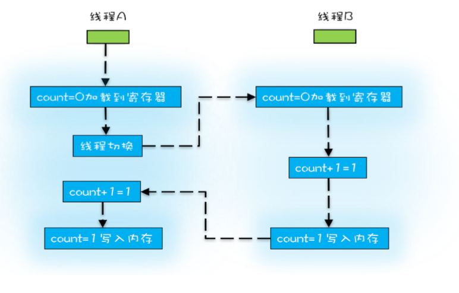
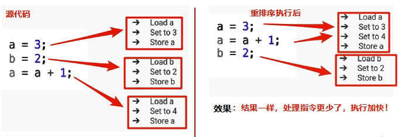
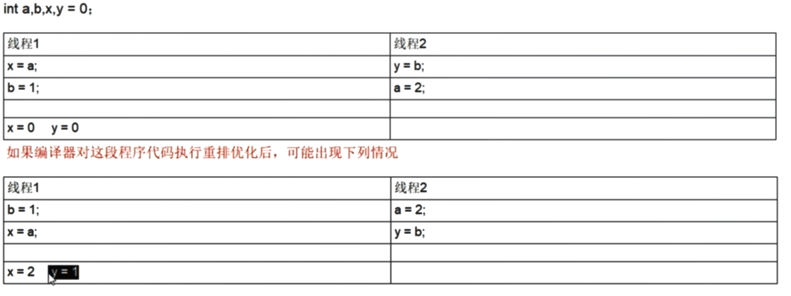
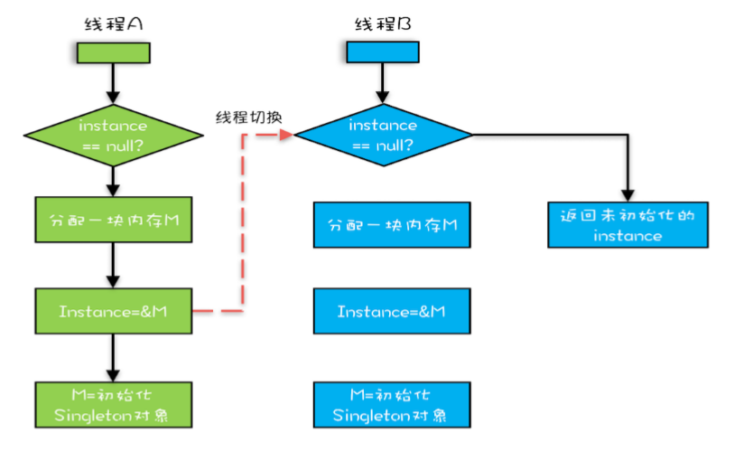

<center><font face='楷书' size='10' color='red'>深入理解volatile</font></center>
# 前置知识

我们知道在计算机中执行速度：CPU高速缓存>内存>外存，由于CPU访问内存有很大的时间开销，因此CPU对于内存中数据的操作不是直接操作内存中的数据，而是先把内存中的数据复制一份到CPU内部的高速缓存中，计算完毕之后再把数据写回到主存中。在多线程下这样可能带来缓存不一致问题，例如线程1和线程2都先后访问同一个共享变量（把主存中的变量复制到自己工作内存空间），线程1对于数据进行操作后在把数据写回主存，但是线程2并没有感知到主存中的数据发生变化，导致线程2中的缓存失效。




为了解决缓存不一致性问题，通常来说有以下2种解决方法：

- 　　通过在总线加锁的方式
- 　　通过缓存一致性协议

　　在早期的CPU当中，是通过在总线上加锁的形式来解决缓存不一致的问题。因为CPU和其他部件进行通信都是通过总线来进行的，如果对总线加锁的话，也就是说阻塞了其他CPU对其他部件访问（如内存），从而使得只能有一个CPU能使用这个变量的内存。这样就解决了缓存不一致的问题。但是上面的方式会有一个问题，由于在锁住总线期间，其他CPU无法访问内存，导致效率低下。

　　所以就出现了缓存一致性协议。最出名的就是Intel 的MESI协议，MESI协议保证了每个缓存中使用的共享变量的副本是一致的。它核心的思想是：当CPU写数据时，如果发现操作的变量是共享变量，即在其他CPU中也存在该变量的副本，会发出信号通知其他CPU将该变量的缓存行置为无效状态，因此当其他CPU需要读取这个变量时，发现自己缓存中缓存该变量的缓存行是无效的，那么它就会从内存重新读取。


<font  size = '5' face='楷体' >**以上理论在Java中体现**:</font>

由于JVM运行程序的实体是线程，而每个线程创建时JVM都会为其创建一个工作内存（有些地方称为栈空间，类似于前面所讲CPU高速缓存），工作内存是每个线程的私有数据区域，而Java内存模型中规定所有的变量都存储再主内存中，主内存是共享内存区域，所有线程都可以访问，但是线程对变量的操作（读取赋值）必须要在工作内存中进行，**首先要将变量从主内存中拷贝到自己的工作内存空间，然后再将变量写回到主内存，**不能直接操作主内存中的变量，各个线程中的工作内存存储主内存的变量副本拷贝，**因此不同的线程间无法访问对方的工作内存**，线程之间的通信（传值）必须通过主内存完成。如下图：




**JMM(Java Memory Model):** Java内存模型，是java虚拟机规范中所定义的一种内存模型，Java内存模型是标准化的，屏蔽掉了底层不同计算机的区别。**Java内存模型(Java Memory Model)描述了Java程序中各种变量(线程共享量)的访问规则，以及在JVM中将变存储到内存和从内存中读取变这样的底层细节。**也就是说它本身是一种抽象的概念并不真实存在，它描述的是一组规范，通过这些规范定义了程序中各个变量（包括实例字段，静态字段和构成数组对象的元素）的访问方式。
**JMM有以下规定:**

+ 所有的共享变量都存储于主内存。这里所说的变量指的是实例变和类变量。不包含局部变量,因为局部变量
  是线程私有的，因此不存在竞争问题。
+ 每一个线程还存在自己的工作内存，线程的工作内存,保留了被线程使用的变量的工作副本。
+ 线程对变星的所有的操作(读，取)都必须在工作内存中完成，而不能直接读写主内存中的变量。
+ 不同线程之间也不能直接访问对方：工作内存中的变量，线程间变量的值的传递需要通过主内存中转来完成。
  本地内存和主内存的关系:

JMM关于同步的规定：

1. 线程解锁前，必须要把共享变量的值刷新回主内存
2. 线程加锁前，必须读取主内存的最新值到自己的工作内存中
3. 解锁和加锁 是同一把锁

## Volatile

volatile：java虚拟机提供的轻量级同步机制，基本遵守JMM规范，不保证原子性、保证可见性、禁止指令重排序保证有序性

### 可见性

验证volatile可见性Demo

```java
class MyData{
    public int value ;
    public void addTo60(){
        this.value = 60;
    }
}

public class VolatileDemo {
    public static void main(String[] args) {
        MyData data = new MyData();
        new Thread(()->{
            System.out.println(Thread.currentThread().getName()+"  coming in...");
            try {
                TimeUnit.SECONDS.sleep(3);
            } catch (Exception e) {
                e.printStackTrace();
            }
            data.addTo60();

        },"AAA").start();


       //循环监视data里边的数据变化，只要主线程没有感知到data里边的数据变化就会一直空循环
       while(data.value == 0){

       }
        System.out.println(Thread.currentThread().getName()+"  data is 60,mission is over!!!");
    }
}
```

问题原因：各个线程对于主内存中共享变量的操作都是通过各个线程各自拷贝到自己的工作内存，进行操作后再写回主内存中的，**但是什么时候写回主内存是不确定的。即使将修改值写回主内存其他线程也无法知道主内存中值有更新。**这就可能存在一个线程AAA修改了共享变量X的值，但是还没有写回主内存时候，另外一个线程BBB又对主内存中的同一个共享变量X进行操作，但是此时线程AAA工作内存中的变量X对BBB线程来说是不可见的，这种工作内存和主内存同步延迟现象就造成了可见性问题。回归到上述代码中，main线程和AAA线程都先将value拷贝到各自工作空间，AAA线程将value改为60，在一个不确定的时间将60写回主内存中。但是mian线程工作空间中的value仍然为0。main线程就会一直执行空循环。解决方案用volatile修饰共享变量value。

volatile实现可见性的原理

- 一：使用volatile关键字会强制将修改的值立即写入主存；
- 二：使用volatile关键字的话，当线程2进行修改时，会导致线程1的工作内存中缓存变量stop的缓存行无效（反映到硬件层的话，就是CPU的L1或者L2缓存中对应的缓存行无效）；
- 三：由于线程1的工作内存中缓存变量stop的缓存行无效，所以线程1再次读取变量stop的值时会去主存读取。


1. 子线程t从主内存读取到数据放入其对应的工作内存
2. 将flag的值更改为true,但是这个时候flag的值还没有写回主内存
3. 此时main方法读取到了flag的值为false
4. 当子线程t将flag的值写回去后，但是main函数里面的while(true)调用的是系统比较底层的代码，速度快，快
   到没有时间再去读取主存中的值,所以while(true)读取到的值一直是false。(如果有个时刻main线程从主内存中读取到了 主内存中flag的最新值，那么if语句就可以执行，main线程何时从主内存中读取最新的值，我们无法控制)

### 原子性

原子性：某个线程正在进行某项具体业务的时候，**中间不可以被打断分割，需要整体完整执行**

要么一起成功，要么一起失败。**我们把一个或者多个操作在 CPU 执行的过程中不被中断的特性称为原子性**

关于原子性的理解

```java
x = 10;         //语句1
y = x;         //语句2
x++;           //语句3
x = x + 1;     //语句4
```

以上4个语句中只有语句1是原子操作，其他的都不是原子操作，**一般对基本类型数据的变量读取和复制时保证原子性的**


Volatile不保证原子性Demo

```java
class MyData2{
    public  volatile  int value = 0;
    public AtomicInteger atomicValue = new AtomicInteger();

    public void atomicMyAdd(){
        atomicValue.getAndIncrement();
    }
    public  void add(){
        value++;
    }
}

public class ValatileDemo2 {
    public static void main(String[] args) {
        MyData2 data = new MyData2();
        for (int i = 0; i < 20; i++) {
            new Thread(()->{
                for (int j = 0; j < 1000; j++) {
                    data.add();
                    data.atomicMyAdd();
                }
            },String.valueOf(i)).start();

        }

        //等到上面所有线程执行完毕之后再取得结果
        //>2，后台一个主线程，一个GC线程
        while(Thread.activeCount() > 2){
            Thread.yield();
        }

        System.out.println(Thread.currentThread().getName()+"  value ="+data.value);//main  value =19348
        System.out.println(Thread.currentThread().getName()+"  atomicValue ="+data.atomicValue);//main  atomicValue =20000

    }
    
}
```

问题分析：线程进行value++并不是原子操作操作需要经过以下三步，注意以下三步并不具有原子性。

1. 首先，需要把变量 count 从内存加载到 CPU 的寄存器；
2. 在寄存器中执行 +1 操作；
3. 将结果写入内存（缓存机制导致可能写入的是 CPU 缓存而不是内存）。


所以可能会存在以下情况：线程A从主内存空间中读取value=0值到线程A的工作空间，此时还未来得及修改数据，线程A阻塞。由于线程A还没有将数据回写回主存，所以不会volatile通知其他线程缓存失效。线程B从主存中读取value=0，将它就自增为1回写主存。然后线程A唤醒再线程A的工作空间自增为1回写回主存，这样两次自增却只加了1次，造成了写数据丢失。

以上文字用图形表示就是下图




**大家是不是有这样的疑问**：“线程A在读取value为0后被阻塞了，没有进行修改所以不会去通知其他线程，此时线程2拿到的还是0，这点可以理解。但是后来线程2修改了value变成1后写回主内存，这下是修改了，线程1再次运行时，难道不会去主存中获取最新的值吗？按照volatile的定义，如果volatile修饰的变量发生了变化，其他线程应该去主存中拿变化后的值才对啊？”
 

**其实严格的说，对任意单个volatile变量的读/写具有原子性，但类似于volatile++这种复合操作不具有原子性。**在《Java并发编程的艺术》中有这一段描述：“在多处理器下，为了保证各个处理器的缓存是一致的，就会**实现缓存一致性协议**，每个处理器通过嗅探在总线上传播的数据来检查自己缓存的值是不是过期了，当处理器发现自己缓存行对应的内存地址被修改，就会将当前处理器的缓存行设置成无效状态，当处理器对这个数据进行**修改操作**的时候，会重新从系统内存中把数据读到处理器缓存里。”**我们需要注意的是，这里的修改操作，是指的一个操作**。而例子中，为什么自增操作会出现那样的结果呢？可以知道自增操作是三个原子操作组合而成的复合操作。**在一个操作中间，读取了count变量后，是不会再读取的count的，所以它的值还是之前读的10，它的下一步是自增操作。**


解决方案：将普通变量替换为JDK提供原子变量AtomicInteger即可，至于为什么原子变量能够提供原子操作，它的底层原理CAS，说到CAS又不得不说ABA问题，再笔者的下一篇博文中回详细介绍CAS和ABA，敬请期待。


### 有序性

#### 什么是重排序

为了提高性能，编译器和处理器常常会对既定的代码执行顺序进行指令重排序。
原因：一个好的内存模型实际上会放松对处理器和编译器规则的束缚，也就是说软件技术和硬件技术都为同一个目
标而进行奋斗:在不改变程序执行结果的前提下，尽可能提高执行效率。JMM对底层尽量减少约束,使其能够发
挥自身优势。因此，在执行程序时，为了高性能，编译器和处理器常常会对指令进行重排序。一般重排序可以分
为如下三种:

1. 编译器优化的重排序。编译器在不改变单线程程序语义的前提下，可以重新安排语句的执行顺序;
2. 指令级并行的重排序。现代处理器采用了指令级并行技术来将多条指令重叠执行。如果不存在数据依赖性,处理器可以改变语句对应机器指令的执行顺序;
3. 内存系统的重排序。由于处理器使用缓存和读/写缓冲区，这使得加载和存储操作看上去可能是在乱序执行的。







#### 重排序可能带来的问题

```java
/**
 * @author xxh
 * @date 2020/1/29
 */
public class ReOrder {
    private  static  int i = 0,j = 0;
    private static int a = 0,b = 0;

    public static void main(String[] args) throws InterruptedException {
        int count = 0;
        while(true){
            count++;
            i = 0;
            j = 0;
            a = 0;
            b = 0;

            Thread threadOne = new Thread(() -> {
                a = 1;
                i = b;
            }, "AAA");

            Thread threadTwo = new Thread(()->{
                   b = 1;
                   j = a;
              },"BBB");

            threadTwo.start();
            threadOne.start();
            threadOne.join();
            threadTwo.join();

            String result = "第"+count+"次（i= "+i+",j="+j+")";
            if(i == 0 && j == 0){
                System.out.println(result);
                break;
            }else {
                System.out.println(result);
            }
        }
    }
}
第9230次（i= 0,j=1)
第10230次（i= 0,j=1)
第10313次（i= 1,j=0)
第10314次（i= 0,j=0)
```

执行情况分析

1. a = 1；i = b（0）；b = 1；j = a（1），最终i = 0，j = 1
2. b = 1；j = a（0）；a = 1；j = b（1），最终i = 1，j = 0
3. b = 1；a = 1；i = b（1）；j = a（1），最终i = 1，j = 1


<font size='5' face='楷体'>**一个关于指令重排序的经典案例**</font>

```java
package com.wuhp;

/**
 * @author xxh
 * @date 2019/10/20
 */
public class Instance {
    private static volatile Instance instance = null;
    private Instance(){
        System.out.println(Thread.currentThread().getName()+"  Instance构造方法");
    }

    public static Instance getInstance(){
        if(instance == null){
            synchronized (instance.getClass()){
                if (instance == null){
                    instance = new Instance();
                }
            }

        }

        return instance;
    }
}
```

其实我们new Instance()的时候一般要有以下三条指令

1. 分配一块内存 M； 
2. 在内存 M 上初始化 Singleton 对象；
3. 将M 的地址赋值给 instance 变量。

但是实际上优化后的执行路径却可能是这样的：

1. 分配一块内存 M； 
2. 将 M 的地址赋值给 instance 变量；
3. 最后在内存 M 上初始化 Singleton 对象。


我们假设线程 A 先执行 getInstance() 方法，当执行完指令 2 时恰好发生了线程切换，切换到了线程 B 上；如果此时线程 B 也执行 getInstance() 方 法，那么线程 B 会发现instance != null，所以直接返回 instance，而此时的 instance 是没有初始化过的，如果我们这个时候访问 instance 的成员变量就可能触发空 指针异常。



线程A进入第二个判空条件，进行初 始化时，发生了时间片切换，即使没有释放锁，线程B刚要进入第一个判空条件时，发现 条件不成立，直接返回instance引用，不用去获取锁。

## Happens-Before规则


上面的内容讲述了重排序原则，为了提高处理速度,，JVM会对代码进行编译优化，也就是指令重排序优化，并发编程下指令重排序会带来一些安全隐患: 如指令排导致的多个线程操作之间的不可见性。如果让程序员再去了解这些底层的实现以及具体规则，那么程序员的负担就太重了，严重影响了并发编程的效率。从JDK 5开始，提出了happens-before的概念，通过这个概念来阐述操作之间的内存可见性**。如果一个操作执行的结果需要对另一个操作可见， 那么这两个操作之间必须存在happens-before关系。**这里提到的两个操作既可以是在一个线程之内, 也可以是在不同线程之间。所以为了解决多线程的可见性问题，就搞出了happens- before原则，让线程之间遵守这些原则。编译器还会优化我们的语句，所以等于是给了编译器优化的约束。不能让它优化的不知道东南西北了!简单来说: happens-before 应该翻译成:前一个操作的结果可以被后续的操作获取。讲白点就是前面一个操作变量a赋值为1,那后面一个操作肯定能知道a已经变成了1。

### 六项规则:

1. 程序顺序规则(线程规则)

+ 解释:一个线程中的每个操作，happens-before于该线程中的任意后续操作

  + 同一个线程中前面的所有写操作对后面的操作可见

  

2. 锁规则(Synchronized,Lock等)

+ 解释:对一个锁的解锁，happens-before于随后对这个锁的加锁。
  + 如果线程1解锁了monitora, 接着线程2锁定了a,那么，线程1解锁a之前的写操作都对线程2可见(线程
    1和线程2可以是同一个线程)


3. volatile变量规则:

+ 解释:对一个volatile域的写， happens- before于任意后续对这个volatile域的读。
  + p如果线程1写入了volatile变量v (临界资源)，接着线程2读取了v,那么，线程1写入以及之前的写操作都
    对线程2可观(线程1和线程2可以是同一个线程)

4. 传递性:

+ 解释:如果A happens-before B,且B happens-before C, 那么A happens-before C。
  + A 对于B可见，B对于C可见，则A对于C可见

5. **start()规则: **

+ 解释:如果线程A执行操作ThreadB.start() (启动线程B) ,那么A线程的ThreadB.start()操作happens-
  before于线程B中的任意操作。
  + 假定线程A在执行过程中，通过执行ThreadB.start()来启动线程B, 那么线程A对共享变量的修改在接下来
    线程B开始执行前对线程B可见。注意:线程B启动之后，线程A在对变量修改线程B未必可见

6. join()规则

+ 解释:如果线程A执行操作ThreadB.join()并成功返回， 那么线程B中的任意操作happens-before于线程A从
  ThreadB.join()操作成功返回。
  + 线程t1写入的所有变量，在任意其它线程t2调用t1.join()，或者t1.isAlive() 成功返回后，都对t2可见

## Volatile的使用场景

## 场景一

volatile不保证原子性，不适合做a++等操作，适合赋值操作例如`boolean flag = true`

线程t1写入的所有变量，在任意其它线程t2调用t1.join()，或者t1.isAlive() 成功返回后，都对2可见

## 场景二

按照volatile的可见性和禁止重排序以及happens-before规则，volatile可以作为刷新之 前变量的触发器。我们可
以将某个变量设置为volatile修饰，其他线程一但发现该变 量修改的值后,触发获取到的该变量之前的操作都将是
最新的且可见。.

# CAS

### 问题回顾

之前介绍Volatile不保证原子性的例子中，举例如下案例。发现即使加了volatile普通变量value经过多线程执行++计算后的结果也无法等于正确答案20000，原因是出现了写覆盖。解决方案加锁或者是使用JDK提供的原子变量。并且提到了原子变量的底层原理就是CAS，今天就来解开CAS神秘面纱。

```java
class MyData2{
    public  volatile  int value = 0;
    public AtomicInteger atomicValue = new AtomicInteger();

    public void atomicMyAdd(){
        atomicValue.getAndIncrement();
    }
    public  void add(){
        value++;
    }
}

public class ValatileDemo2 {
    public static void main(String[] args) {
        MyData2 data = new MyData2();
        for (int i = 0; i < 20; i++) {
            new Thread(()->{
                for (int j = 0; j < 1000; j++) {
                    data.add();
                    data.atomicMyAdd();
                }
            },String.valueOf(i)).start();

        }

        //等到上面所有线程执行完毕之后再取得结果
        //>2，后台一个主线程，一个GC线程
        while(Thread.activeCount() > 2){
            Thread.yield();
        }

        System.out.println(Thread.currentThread().getName()+"  value ="+data.value);//main  value =19348
        System.out.println(Thread.currentThread().getName()+"  atomicValue ="+data.atomicValue);//main  atomicValue =20000

    }
    
}
```


### CAS简介

CAS的全称为Compare-And-Swap ，它是一条CPU并发原语，**它的功能是判断内存某个位置的值是否为预期值,如果是则更新为新的值，这个过程是原子的。**CAS有3个操作数，内存值V，旧的预期值A，要修改的新值B。当且仅当预期值A和内存值V相同时，将内存值V修改为B，否则什么都不做。


举个栗子：

```java
public class CAS {
    public static void main(String[] args) {
        AtomicInteger atomic = new AtomicInteger(5);

        System.out.println(atomic.compareAndSet(5, 2019)+"  current data  "+atomic.get());
        System.out.println(atomic.compareAndSet(5, 2020)+"  current data  "+atomic.get());

    }
}
输出结果：
    true  current data  2019
    false  current data  2019
```

​	在atomic.compareAndSet(5, 2019)，中第一个参数是期望值，第二个参数为更新值，如果主内存中的值和期望值一样就更新为更新值。

​	上述Demo中主线程操作主内存中的atomic变量，首先主线程要把主内存中的atomic值拷贝一份到线程工作内存中，然后会把这个拷贝变量的值和主内存中的值做对比，如果没有发生变化就将主内存中的atomic值更新为2019。再次进行相同的操作由于主内存已经更新为2019，所以compareAndSet方法不会更新值为2020。

​	CAS并发原语体现在JAVA语言中就是sun.misc.Unsafe类中的各个方法，调用Unsafe类中的CAS方法，JVM会帮助我们实现出CAS汇编指令。这是一种依赖于硬件的功能，通过它实现了原子操作。再次强调，由于CAS是一种系统原语，原语是属于操作系统用于范畴，是由若干条指令组成的，用于完成某个功能的一个过程，并且原语的执行必须是连续的，在执行过程中不允许中断，也就是说CAS是一条CPU的原子指令，不会造成所谓的数据不一致问题。

**CAS底层原理自旋锁+unsafe类**

### Unsafe类

简介：Unsafe类是CAS的核心类，由于java方法无法直接访问底层的操作系统，需要通过本地（native）方法来访问，**unsafe相当与一个后门，基于该类可以直接操作特定内存中地数据**，Unsafe类存在与sun.misc包中，其内部方法操作可以像C的指针一样直接操作内存，因为Java中CAS操作的执行依赖于Unsafe类方法。注意：Unsafe类中所有的方法都是native修饰的，也就是说Unsafe类中的方法都是直接调用操作系统底层执行相应的任务。

```java
//AtomicInteger的getAndIncrement底层调用的是Unsafe类的getAndAddInt方法
public class AtomicInteger extends Number implements java.io.Serializable {
    public final int getAndIncrement() {
            return U.getAndAddInt(this, VALUE, 1);
   //this:AtomicInteger对象本身，VALUE：对象的地址，1：自增量     
        }
}    

public final class Unsafe {
  @HotSpotIntrinsicCandidate
    public final int getAndAddInt(Object o, long offset, int delta) {
        int v;
        do {
            v = getIntVolatile(o, offset);
        } while (!weakCompareAndSetInt(o, offset, v, v + delta));
        return v;
    }  
}
```


### CAS的缺点

1. 只能保证对于一个共享变量的原子操作，对于多个共享变量的共享操作只能通过加锁的方式。
2. 循环时间长，开销很大。
3. 会有ABA问题

原子类AtomicInteger的ABA问题和原子更新引用问题？

ABA问题：CAS算法实现一个重要前提需要提取出内存中某个时刻的数据并在当下时刻进行比较替换，那么在这个时间差内回导致数据的变化。比如一个线程1从内存位置V中取出A，这个时候另一个线程2也从内存中取出A，并且线程2进行了一些操作将值变成了B，然后线程2又将V位置的数据变成A，这时候线程1进行CAS操作发现内存中数据仍然是A，线程1操作成功。

#### ABA问题演示

```java
public static void main(String[] args) throws Exception {
        AtomicReference<Integer> atomic = new AtomicReference<>(10);
        //线程AAA完成一次ABA操作
        new Thread(()->{
            System.out.println(
                    atomic.compareAndSet(10,100)+"  "
                    +Thread.currentThread().getName()
                    +"  atomic value is "+atomic.get());

            System.out.println(
                    atomic.compareAndSet(100,10)+"  "
                    +Thread.currentThread().getName()
                    +"  atomic value is "+atomic.get());

        },"AAA").start();

        //线程BBB在AAA完成一次ABA操作之后再设置值
        new Thread(()->{
            //等待线程AAA完成一次ABA操作
              try{TimeUnit.SECONDS.sleep(3);} catch (Exception e) {e.printStackTrace();}
            System.out.println(
                    atomic.compareAndSet(10,9999)+"  "
                    +Thread.currentThread().getName()
                    +"  atomic value is "+atomic.get());
              
        },"BBB").start();

    }

输出结果
true  AAA  atomic value is 100
true  AAA  atomic value is 10
true  BBB  atomic value is 9999

```


#### ABA问题的解决

需要借助**AtomicStampedReference**类，解决方案类似于乐观锁的版本号机制。每次修改的时候版本号都要变化，每次比较的时候不仅需要比较值还需要比较版本号。

```java
 public static void main(String[] args) throws Exception {
        AtomicStampedReference<Integer> atomicStamp = new AtomicStampedReference<Integer>(10,1);
     
     //线程CCC用于完成一次ABA操作，每做一次修改都会是版本号自增1
        new Thread(()->{
            int stamp = atomicStamp.getStamp();
            System.out.println(Thread.currentThread().getName()
                               +" 初始版本号："+stamp
                               +"  初始值:"+atomicStamp.getReference());

            boolean b = atomicStamp.compareAndSet(10,100,atomicStamp.getStamp(),atomicStamp.getStamp()+1);
            System.out.println(Thread.currentThread().getName()+" 修改成功否 "+b);
            System.out.println(" 版本号2: "+atomicStamp.getStamp()+" value is "+atomicStamp.getReference());
            
            boolean b1 = atomicStamp.compareAndSet(100,10,atomicStamp.getStamp(),atomicStamp.getStamp()+1);
            System.out.println(Thread.currentThread().getName()+" 修改成功否 "+b1);
            System.out.println(" 版本号3: "+atomicStamp.getStamp()+" value is "+atomicStamp.getReference());

        },"CCC").start();
     
     

        new Thread(()-> {
            int stamp = atomicStamp.getStamp();
            System.out.println(Thread.currentThread().getName()+" 初始版本号："+stamp+"  初始值:"+atomicStamp.getReference());
            
            //等待线程CCC完成ABA操作
            try{TimeUnit.SECONDS.sleep(3);} catch (Exception e) {e.printStackTrace();}
            boolean b3 = atomicStamp.compareAndSet(10,9999,stamp,stamp+1);
            
            System.out.println(Thread.currentThread().getName()+" 修改成功否 "+b3);
            System.out.println(" 版本号4: "+atomicStamp.getStamp()+" value is "+atomicStamp.getReference());

        },"DDD").start();

    }

DDD 初始版本号：1  初始值:10
CCC 初始版本号：1  初始值:10
CCC 修改成功否 true
 版本号2: 2 value is 100
CCC 修改成功否 true
 版本号3: 3 value is 10
DDD 修改成功否 false
 版本号4: 3 value is 10

```

>  参考资料    

https://www.jianshu.com/p/f74044782927

https://www.cnblogs.com/dolphin0520/p/3920373.html


