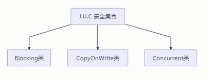
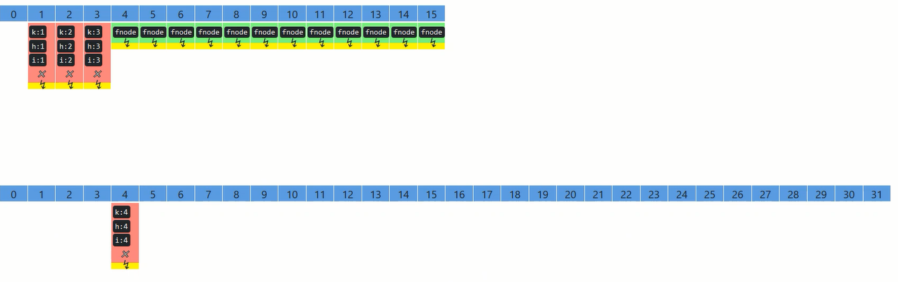

# 线程安全集合分类类

1. **遗留的线程安全集合如Hashtable, Vector**

2. **使用Collections装饰的线程安全集合**
   	+ Collections. synchronizedCollection
   	+ Collections . synchronizedList
   	+ Collections . synchronizedMap
   	+ Collections . synchronizedSet 
   	+ Collections . synchronizedNavigableMap
   	+ Collections . synchronizedNavigableSet
   	+ Collections. synchronizedSortedMap
   	+ Collections. synchronizedSortedSet

3. **java. util. concurrent.**




java. util. concurrent下的线程安全集合类，可以发现它们有规律，里面包含三类关键词:
Blocking、CopyOnWrite、 Concurrent

+ Blocking大部分实现基于锁，并提供用来阻塞的方法
+ CopyOnWrite 之类容器修改开销相对较重
+ Concurrent 类型的容器
  + 内部很多操作使用cas优化，一般可以提供较高吞吐量
  + 弱一致性
    + 遍历时弱一致性,例如，当利用迭代器遍历时，如果容器发生修改，迭代器仍然可以继续进行遍历，这时内容是旧的
    + 求大小弱一致性，size操作未必是100%准确
    + 读取弱一致性，

> 遍历时如果发生了修改，对于非安全容器来讲，使用fail-fast 机制也就是让遍历立刻失败，抛出
> ConcurrentModificationException，不再继续遍历 。线程安全集合采用的是fail-safe的机制能够并发修改


JDK7中的并发死链问题

注意：在jdk7中HashMap如果产生冲突采用拉链法解决冲突，后插入链表的节点总是在头部，这样在多线程环境下可能造成在扩容的时候出现并发死链问题。jdk8冲突解决方案是链表+红黑树，在链表中后插入的节点在链表尾部，不会出现并发死链问题，但是可能出现丢失数据的问题。


# 死链复现


调试工具使用idea

在HashMap源码590行加条件断点。断点的条件如下，断点类型要设置成Thread

`int newCapacity = newTable. length;`
目的是让HashMap在扩容为32时，并且线程为Thread-0 或Thread-
1时停下来

```java
newTable.length==32 &&
(
    Thread . currentThread(). getName(). equals("Thread-0")||
    Thread. currentThread(). getName(). equals( "Thread-1")
)
```


断点暂停方式选择Thread,否则在调试Thread-0时，Thread-1 无法恢复运行


**ConcurrentHashMap中重要的属性**

```java
//默认为0,当初始化时，为-1,当扩容时，为-(1+扩容线程数)
//当初始化或扩容完成后，为下一 -次的扩容的阙值大小
private transient volatile int sizeCtl;

//整个ConcurrentHashMap 就是一个Node[]
static class Node<K,V> implements Map . Entry<K,V> {}

// hash表
transient volatile Node<K,V>[] table;

//扩容时的新hash 表
private transient volatile Node<K,V>[] nextTable;

//扩容时如果某个bin迁移完毕，用ForwardingNode 作为旧table bin 的头结点
static final class ForwardingNode<K,V> extends Node<K,V> {}

//用在compute 以及computeIfAbsent 时，用来占位，计算完成后替换为普通Node
static final class ReservationNode<K,V> extends Node<K,V> {}

//作为treebin 的头节点，存储root 和first
static final class TreeBin<K,V> extends Node<K,V> {}

//作为treebin 的节点，存储parent, left, right
static final class TreeNode<K,V> extends Node<K,V> {}

```


ForwardingNode属性说明

扩容的时候依此将table中的节点移至扩容后的nextTable中，每次将table一个位置的节点转移后就在当前位置处挂ForwardingNode节点，表示table这个位置的节点已经转移，其中ForwardingNode的hashCode是-1




 当数组长度扩容到64以后，而且链表的长度大于8时候由链表变为红黑树


**ConcurrentHashMap重要方法**

```java
//获取Node[] 中第i个Node
static final <K,V> Node<K,V> tabAt(Node<K,V>[] tab, int i)

//cas修改Node[]中第i个Node的值，c为旧值，v为新值
static final <K,V> boolean casTabAt(Node<K,V>[] tab, int i, Node<K,V> C，Node<K,V> v)

    // 直接修改 Node[]中第i个Node 的值，v为新值
static final <K,V> void setTabAt (Node<K,V>[] tab，int i, Node<K,V> v)

```


**构造器分析**
可以看到实现了懒惰初始化，在构造方法中仅仅计算了table 的大小，以后在第一-次使用时才会真正创建

```java
 public ConcurrentHashMap(int initialCapacity, float loadFactor, int concurrencyLevel) {
   //initialCapacity:初始容量16  loadFactor：负载因子0.75  concurrencyLevel：并发度
        if (!(loadFactor > 0.0f) | initialCapacity < 0|| concurrencyLevel <= 0)
        throw new IllegalArgumentException();
        if (initialCapacity < concurrencyLevel)// Use at least as many bins
            initialCapacity = concurrencyLevel;// as estimated threads
        long size = (1ong)(1.0 + (long)initialCapacity / loadFactor);
        // tableSizeFor 仍然是保证计算的大小是2^n, 即16,32,64
        int cap = (size >= (1ong)MAXIMUM_ CAPACITY) ?
        MAXIMUM_ CAPACITY : tableSizeFor((int) size);
        this.sizeCt1 = cap;

    }
```


**get流程**

```java
 public V get(Object key) {
        Node<K,V>[] tab; Node<K,V> e,p; int n, eh; K ek;
        //spread方法能确保返回结果是正数
        int h = spread(key .hashCode());
        if ((tab = table) != nu1l && (n = tab.length) >0 &&
            //(n-1)&h相当于%运算，效率更高，定位桶的位置
                (e = tabAt(tab,(n - 1) & h)) != null) {
            //如果头结点已经是要查找的key
            if ((eh = e.hash) == h) {
                if ((ek = e.key) == key|| (ek != null && key. equals(ek)))
                    return e.val;
            }
			// hash为负数表示该bin在扩容中或是treebin, 这时调用find 方法来查找
            else if (eh < 0)
                return (p = e.find(h, key)) != nu1l ? p.val : nu11;
			//正常遍历链表，用equals 比较
            while ((e = e.next) != nu11) {
                if (e.hash == h &&
                        ((ek = e.key) == key | (ek != nu1l && key.equals(ek))))
                    return e.val;

            }
        }
        return nu1l;
```


**put流程**

以下数组简称（table），链表简称bin

```java
 public V put(K key, V value) {
        return putVal(key, value, false);
    }
```


**Size计算流程**

size计算实际发生在put, remove改变集合元素的操作之中

+ 没有竞争发生，向baseCount累加计数
+ 有竞争发生，新建counterCells,向其中的一个cell累加计数
   + counterCells 初始有两个cell
   + 如果计数竞争比较激烈，会创建新的cell来累加计数

```java
 public int size() {
        long n = sumCount();
        return ((n < 0L) ? 0 :
                (n > (long) Integer.MAX_VALUE) ? Integer.MAX_VALUE : (int) n);
    }

 final long sumCount() {
        CounterCe11[] as = counterCells;
        CounterCe1l a;
        //将baseCount计数与所有cell 计数累加
        long sum = baseCount;
        if (as != null) {
            for (int i = 0; i < as.length; ++i) {
                if ((a = as[i]) != null)
                    sum += a.value;
            }
            return sum;
        }

    }


```


