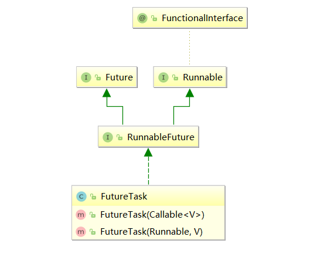
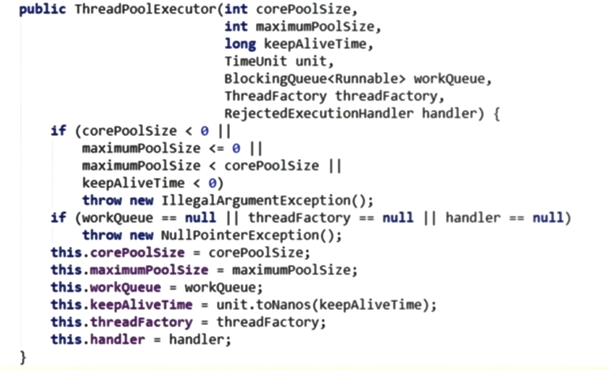
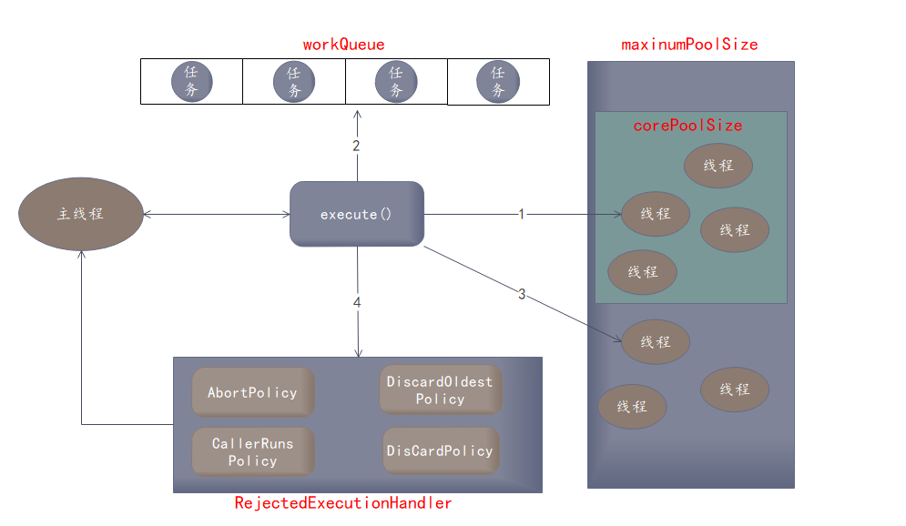

# Callable接口

**如何理解实现Callable接口的方式创建多线程比实现Runnable接口创建多线程方式强大？**

1. call()可以有返回值的。

2. call()可以抛出异常，被外面的操作捕获，获取异常的信息

3. Callable是支持泛型的

Callable接口创建线程步骤

- 编写自定义任务类实现Callable<T>接口
- FutureTask futureTask = new FutureTask()；将自定义任务类作为构造参数传入
- new Thread()；将futureTask 类作为构造参数传入
- 获取线程执行结果通过futureTask.get()；




```java
class MyCallable implements Callable<Integer>{
    @Override
    public Integer call() throws Exception {
        System.out.println(Thread.currentThread().getName()+"  线程并行执行任务");
        //线程休眠
        try{ TimeUnit.SECONDS.sleep(2); } catch (Exception e) { e.printStackTrace(); }

        return 1024;

    }
}

public class CallableDemo {
    public static void main(String[] args) throws Exception {
        MyCallable myCallable = new MyCallable();
        FutureTask<Integer> futureTask = new FutureTask<>(myCallable);
        new Thread(futureTask,"AAA").start();
		/*
		多个线程传入同一个futureTask，call方法只会执行一次。要想多个线程都执行同一个call方法
		多次new 相同的FutureTask类，传入不同的线程中即可。 
		FutureTask<Integer> futureTask2 = new FutureTask<>(myCallable);
         new Thread(futureTask2,"BBB").start();
        */
        new Thread(futureTask,"BBB").start();
        System.out.println("main线程执行任务");


       /*
        由于调用get()方法会阻塞当前的main线程，直到AAA线程执行完毕main线程才能继续执行，
        为了使得main线程和AAA线程并行执行，get()方法一般放置最后执行
        */
        while(!futureTask.isDone()){

        }
        Integer result = futureTask.get();
        System.out.println("AAA线程执行结果为："+result);

    }
}

main线程执行任务
AAA  线程并行执行任务
AAA线程执行结果为：1024
```

注意事项：

1. 在当前线程A中调用FutureTask的get()方法获取B线程的执行结果，这会导致A线程阻塞，直到B线程执行完毕。为了使得A线程和B线程更好的并行执行通常在A线程的最后调用get()方法
2. **多个线程传入同一个futureTask，call方法只会执行一次。**


# 线程池

为什么要使用线程池？使用线程池的优势是什么？

作用：

​	线程池做的工作主要是控制运行的线程的数量，处理过程中将任务放入队列，然后再线程创建后启动这些任务，如果线程数量超过了最大的数量的线程排队等候，等其他线程执行完毕，再从队列中取出任务来执行。主要特定：线程复用，控制最大并发数，管理线程。**在阿里巴巴java开发手册中，使用线程池的好处是减少在创建和销毁线程上所花的时间以及系统资源的开销，解决资源不足的问题。如果不使用线程池，有可能造成系统创建大量同类线程而导致消耗完内存或者 “过度切换”的问题。**

优势：

1. 降低资源消耗，通过重复利用已经创建的线程降低线程创建和销毁造成的消耗
2. 提高响应速度，当任务到达时，任务可以不需要等到线程创建就能立即执行。
3. 提高线程的可管理性。线程时稀缺资源，如果无限制的创建，不仅会消耗系统资源，还会降低系统的稳定性，使用线程池可以进行同一的分配，调优和监控。


Java中的线程池是通过Executor框架实现的，该框架用到了Executor，Executors，ExecutorService，ThreadPoolExecutor这几个类


## 线程池常用创建方式

Executors.newFixedThreadPool(int)

​	创建一个固定长度的线程池，不可以扩容。可以控制线程的最大并发数量，超出的线程会在队列中等待。**这种方式创建的线程池corePoolSize和maxinumPoolSize的值是相等的**，它使用的是LinkedBlockingQueue。（**注意： LinkedBlockingQueue默认大小是Integer.MAX_VALUE**）

```java
  public static ExecutorService newFixedThreadPool(int nThreads) {
        return new ThreadPoolExecutor(nThreads, nThreads,
                                      0L, TimeUnit.MILLISECONDS,
                                       //LinkedBlockingQueue默认大小是Integer.MAX_VALUE
                                      new LinkedBlockingQueue<Runnable>());
    }
```


Executors.newSingleThreadExecutor();

​	创建一个单线程化的线程池，它只会用唯一的工作线程来执行任务，保证所有任务按照指定顺序执行。**这种方式创建创建的线程池将corePoolSize和maxinumPoolSize都设置为1**，它使用的是LinkedBlockingQueue。

```java
 public static ExecutorService newSingleThreadExecutor() {
        return new FinalizableDelegatedExecutorService
            (new ThreadPoolExecutor(1, 1,
                                    0L, TimeUnit.MILLISECONDS,
                                    //LinkedBlockingQueue默认大小是Integer.MAX_VALUE
                                    new LinkedBlockingQueue<Runnable>()));
    }
```


Executors.newCachedThreadPool();

​	创建一个可缓存线程池，**如果线程池长度超过处理需要，可以灵活回收空闲线程，若无可回收，则创建新线程，这种方式创建的线程池将corePoolSize设置为0，将maxinumPoolSize设置为Integer.MAX_VALUE**，使用的是SynchronousQueue，也就是说来了任务就创建线程运行，当线程空闲超过60秒就销毁线程。它底层使用的阻塞队列是SynchronousQueue

```java
 public static ExecutorService newCachedThreadPool() {
        return new ThreadPoolExecutor(0, Integer.MAX_VALUE,
                                      60L, TimeUnit.SECONDS,
                                      new SynchronousQueue<Runnable>());
    }
```


**总结：上面三种无论哪种方式创建线程池底层都是用了ThreadPoolExecutor，底层的数据结构都是阻塞队列。**

线程池的简单使用，模拟10个人到5个窗口办理业务。

```java
public class MyThreadPool {
    public static void main(String[] args) {
        ExecutorService pool = Executors.newFixedThreadPool(5);
        try {
            for (int i = 0; i < 10; i++) {
                pool.submit(()->{
                    System.out.println(Thread.currentThread().getName()+"\t 处理业务");
                });

            }
        }catch (Exception e){
            e.printStackTrace();
        }finally {
            pool.shutdown();
        }

    }
}
```

# 线程池七大参数

```java
public ThreadPoolExecutor(int corePoolSize,
                              int maximumPoolSize,
                              long keepAliveTime,
                              TimeUnit unit,
                              BlockingQueue<Runnable> workQueue) {
        this(corePoolSize, maximumPoolSize, keepAliveTime, unit, workQueue,
             Executors.defaultThreadFactory(), defaultHandler);
    }
```




1. corePoolSize：线程池中的常驻核心线程数。在创建线程池之后，当有请求任务来了之后，就会安排池中的线程去执行请求任务，近似理解为今日当值线程。当线程池中的线程数目达到corePoolSize后，就会把到达的任务放到缓存队列中。
2. maxinumPoolSize：线程池中能够容纳同时执行的最大线程数，此值必须大于等于1
3. keepAliveTime：多余的空闲线程的存活时间。当前线程池数量超过corePoolSize时候，当空闲时间达到keepAliveTime值时候，多余空闲线程会被销毁直到剩下corePoolSize数量个线程位置。默认情况下，只有当线程池中对额线程数大于corePoolSize时keepAliveTime才会起作用，直到线程池中的线程数量不大于corePoolSize。
4. unit：keepAliveTime的单位
5. workQueue：任务队列，被提交但是尚未被执行的任务
6. threadFactory：表示生成线程池中工作线程线程工厂，**用于创建线程一般用默认即可**
7. handler：拒绝策略，表示当前队列满了并且线程大于或者等于线程池的最大线程数时如何来拒绝请求执行的runnable的策略

# 线程池原理

1. 在创建了线程池后，等待提交过来的任务请求

2. 当调用execute()方法添加一个请求任务时候，线程池会做如下判断

   2.1 如果正在运行的线程数量<corePoolSize，马上创建线程处理这个任务

   2.2 如果正在运行的线程数量>=corePoolSize，就将这个任务加入队列

   2.3 如果这个时候队列满了而且正在运行线程数<maxinumPoolsize，就创建非核心线程立刻处理这个任务

   2.4 如果队列满了，而且正在运行线程数量>=maxinumPoolsize，那么线程就会启动饱和拒绝策略来执行

   

3. 当一个线程完成任务时候，它会从队列中取出下一个任务执行

4. 当一个线程空闲超过keepAliveTime是，线程池会判断如果当前运行的线程数量大于corePoolSize，那么这个线程会被销毁，所以线程池的所有任务完成之后它最终会收缩到corePoolSize的大小。

   




# 线程池的拒绝策略

所谓的拒绝策略就是线程池需要分配的线程数量大于线程池最大容量，无法分配新的线程处理当前任务时候的策略。JDK默认提供了以下四种拒绝策略

AbortPolicy（默认）：直接抛出RejectedExecutionExeception异常阻止系统运行

CallerRunsPolicy：“调用者运行”一种调节机制，该策略既不会抛弃任务，也不会抛出异常，而是将某些任务回退到调用者

DiscardOldestPolicy：抛弃队列中等待最久的任务，然后把当前任务加入队列中尝试再次提交当前任务

DiscardPolicy：直接多余丢弃任务，不予任何处理也不会抛出异常。如果允许任务丢失，这是最好的解决方案。

这四种拒绝策略均实现了RejectedExecutionHandler接口


## 代码验证四种拒绝策略

由于使用Executors创建的线程池workQueue队列默认的长度是Integer.MAX_VALUE，这个数字太大，即使使用默认的拒绝策略也一般不会抛出相应的异常，反而可能造成OOM，所以阿里巴巴java技术手册要求不能使用Executors的方式创建线程池，而是应该使用ThreadPoolExecutor的方式创建线程。

### AbortPolicy策略

在自定义的线程池中maximumPoolSize=5，workQueue=3，所以该线程池能够接受的最大请求数为8，而请求数却是10，使用AbortPolicy拒绝策略超过8个请求就会抛出异常

```java
public class MyThreadPool {
    public static void main(String[] args) {

        ExecutorService pool = new ThreadPoolExecutor(3,
                5,
                1L,
                TimeUnit.SECONDS,                                       
                new LinkedBlockingQueue<>(3),
                Executors.defaultThreadFactory(),
				//创建自定义线程池，使用AbortPolicy拒绝策略，请求线程超过8就会抛出异常                               new ThreadPoolExecutor.AbortPolicy());
        try {
            for (int i = 0; i < 10; i++) {
                int temp = i;
                pool.submit(()->{
                    System.out.println(Thread.currentThread().getName()+"\t 处理业务" + temp);
                });

            }
        }catch (Exception e){
            e.printStackTrace();
        }finally {
            pool.shutdown();
        }

    }
}
                                                      
pool-1-thread-1	 处理业务0
java.util.concurrent.RejectedExecutionException: Task java.util.concurrent.FutureTask@b4c966a rejected from java.util.concurrent.ThreadPoolExecutor@2f4d3709[Running, pool size = 5, active threads = 5, queued tasks = 3, completed tasks = 0]
pool-1-thread-2	 处理业务1
pool-1-thread-1	 处理业务3
	at java.util.concurrent.ThreadPoolExecutor$AbortPolicy.rejectedExecution(ThreadPoolExecutor.java:2047)
pool-1-thread-2	 处理业务4
pool-1-thread-2	 处理业务5
	at java.util.concurrent.ThreadPoolExecutor.reject(ThreadPoolExecutor.java:823)
pool-1-thread-3	 处理业务2
	at java.util.concurrent.ThreadPoolExecutor.execute(ThreadPoolExecutor.java:1369)
pool-1-thread-4	 处理业务6
	at java.util.concurrent.AbstractExecutorService.submit(AbstractExecutorService.java:112)
pool-1-thread-5	 处理业务7
	at com.ThreadPool.MyThreadPool.main(MyThreadPool.java:26)
```

### CallerRunsPolicy策略

“调用者运行”一种调节机制，该策略既不会抛弃任务，也不会抛出异常，而是将某些任务回退到调用者。在本例中超出的两个请求会被交还给main线程处理

```java
//将上述代码创建线程池的拒绝策略改变，其他不变 
ExecutorService pool = new ThreadPoolExecutor(3,
                5,
                1L,
                TimeUnit.SECONDS,
                new LinkedBlockingQueue<>(3),
                Executors.defaultThreadFactory(),
                new ThreadPoolExecutor.CallerRunsPolicy());


pool-1-thread-1	 处理业务0
main	 处理业务8    //请求数为10，超过的两个请求交给调用者main线程处理
main	 处理业务9
pool-1-thread-2	 处理业务1
pool-1-thread-2	 处理业务3
pool-1-thread-2	 处理业务4
pool-1-thread-2	 处理业务5
pool-1-thread-4	 处理业务6
pool-1-thread-3	 处理业务2
pool-1-thread-5	 处理业务7
```

### DiscardOldestPolicy

抛弃队列中等待最久的任务，然后把当前任务加入队列中尝试再次提交当前任务。

```java
 ExecutorService pool = new ThreadPoolExecutor(3,
                5,
                1L,
                TimeUnit.SECONDS,
                new LinkedBlockingQueue<>(3),
                Executors.defaultThreadFactory(),
                new ThreadPoolExecutor.DiscardOldestPolicy());


pool-1-thread-1	 处理业务0
pool-1-thread-1	 处理业务5
pool-1-thread-1	 处理业务8
pool-1-thread-1	 处理业务9
pool-1-thread-2	 处理业务1
pool-1-thread-3	 处理业务2
pool-1-thread-4	 处理业务6
pool-1-thread-5	 处理业务7

执行结果中3和4请求被丢弃，由此可知该队列中3和4请求时等待时间最久的
```

### DiscardPolicy

直接多余丢弃任务，不予任何处理也不会抛出异常。

```java
ExecutorService pool = new ThreadPoolExecutor(3,
                5,
                1L,
                TimeUnit.SECONDS,
                new LinkedBlockingQueue<>(3),
                Executors.defaultThreadFactory(),
                new ThreadPoolExecutor.DiscardOldestPolicy());

pool-1-thread-2	 处理业务1
pool-1-thread-2	 处理业务3
pool-1-thread-2	 处理业务4
pool-1-thread-2	 处理业务5
pool-1-thread-1	 处理业务0
pool-1-thread-3	 处理业务2
pool-1-thread-4	 处理业务6
pool-1-thread-5	 处理业务7

从执行结果来看请求8和请求9会被抛弃
```


# 合理配置线程池参数

**如何合理配置线程池参数？**

首先要获取硬件参数，通过Runtime.getRuntime().availableProcessors()获取CPU的核心数目

然后要区分所执行的任务是CPU密集型还是IO密集型。

**CPU密集型**：该任务需要大量的运算，而没有阻塞，CPU一直全速运行。

CPU密集任务只有在真正的多核CPU上才可能得到加速（通过多线程）。而在单核CPU上无论开几个模拟的多线程，该任务都不可能得到加速，因为CPU总的运算能力就是那么多。CPU密集型任务配置尽可能少的线程数量：一般公式：CPU核数+1线程的线程池


**IO密集型**：执行该任务需要大量的IO，即大量的阻塞。在单线程上运行IO密集型的任务会导致浪费大量的CPU运算能力在等待上。所以在IO密集型任务中使用多线程可以大大的加速程序的运行，即使在单核CPU上，这种加速就是利用了被浪费掉的阻塞时间。IO密集型大部分线程被阻塞，故需要多配置线程数。一般有以下两种配置策略

1. 由于IO密集型任务线程并不是一直在执行任务，则应该配置尽可能多的线程，如CPU核数*2

2. 参考公式：CPU核数 / （1 - 阻塞系数）【阻塞系数在0.8~0.9之间】

   比如8核CPU：线程池应配置8/（1-0.9）= 80个线程数。


# 注意事项

阿里巴巴java开发手册v1.2中对线程池中有以下两点注意事项

 【强制】线程资源必须通过线程池提供，不允许在应用中自行显式创建线程。 

说明：使用线程池的好处是减少在创建和销毁线程上所花的时间以及系统资源的开销，解决资源不足的问题。如果不使用线程池，有可能造成系统创建大量同类线程而导致消耗完内存或者 “过度切换”的问题。 

【强制】**线程池不允许使用 Executors 去创建，而是通过 ThreadPoolExecutor 的方式**，这样的处理方式让写的同学更加明确线程池的运行规则，规避资源耗尽的风险。 

说明：Executors 返回的线程池对象的弊端如下： 

1. FixedThreadPool 和 SingleThreadPool:   **允许的请求队列长度为 Integer.MAX_VALUE**，可能会堆积大量的请求，从而导致 OOM。 

2. CachedThreadPool 和 ScheduledThreadPool:   允许的创建线程数量为 Integer.MAX_VALUE，可能会创建大量的线程，从而导致 OOM。 


