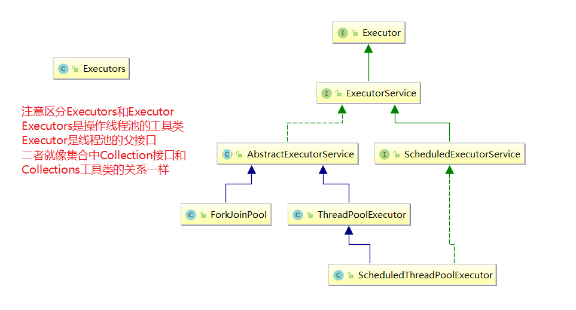

# Callable接口

**如何理解实现Callable接口的方式创建多线程比实现Runnable接口创建多线程方式强大？**

1. call()可以有返回值的。

2. call()可以抛出异常，被外面的操作捕获，获取异常的信息

3. Callable是支持泛型的

Callable接口创建线程步骤

- 编写自定义任务类实现Callable<T>接口
- FutureTask futureTask = new FutureTask()；将自定义任务类作为构造参数传入
- new Thread()；将futureTask 类作为构造参数传入
- 获取线程执行结果通过futureTask.get()；


```java
class MyCallable implements Callable<Integer>{
    @Override
    public Integer call() throws Exception {
        System.out.println(Thread.currentThread().getName()+"  线程并行执行任务");
        //线程休眠
        try{ TimeUnit.SECONDS.sleep(2); } catch (Exception e) { e.printStackTrace(); }

        return 1024;

    }
}

public class CallableDemo {
    public static void main(String[] args) throws Exception {
        MyCallable myCallable = new MyCallable();
        FutureTask<Integer> futureTask = new FutureTask<>(myCallable);
        new Thread(futureTask,"AAA").start();
		/*
		多个线程传入同一个futureTask，call方法只会执行一次。要想多个线程都执行同一个call方法
		多次new 相同的FutureTask类，传入不同的线程中即可。 
		FutureTask<Integer> futureTask2 = new FutureTask<>(myCallable);
         new Thread(futureTask2,"BBB").start();
        */
        new Thread(futureTask,"BBB").start();
        System.out.println("main线程执行任务");


       /*
        由于调用get()方法会阻塞当前的main线程，直到AAA线程执行完毕main线程才能继续执行，
        为了使得main线程和AAA线程并行执行，get()方法一般放置最后执行
        */
        while(!futureTask.isDone()){

        }
        Integer result = futureTask.get();
        System.out.println("AAA线程执行结果为："+result);

    }
}

main线程执行任务
AAA  线程并行执行任务
AAA线程执行结果为：1024
```

注意事项：

1. 在当前线程A中调用FutureTask的get()方法获取B线程的执行结果，这会导致A线程阻塞，直到B线程执行完毕。为了使得A线程和B线程更好的并行执行通常在A线程的最后调用get()方法
2. **多个线程传入同一个futureTask，call方法只会执行一次。**


# 线程池

为什么要使用线程池？使用线程池的优势是什么？

作用：

​	线程池做的工作主要是控制运行的线程的数量，处理过程中将任务放入队列，然后再线程创建后启动这些任务，如果线程数量超过了最大的数量的线程排队等候，等其他线程执行完毕，再从队列中取出任务来执行。主要特定：线程复用，控制最大并发数，管理线程。

优势：

1. 降低资源消耗，通过重复利用已经创建的线程降低线程创建和销毁造成的消耗
2. 提高响应速度，当任务到达时，任务可以不需要等到线程创建就能立即执行。
3. 提高线程的可管理性。线程时稀缺资源，如果无限制的创建，不仅会消耗系统资源，还会降低系统的稳定性，使用线程池可以进行同一的分配，调优和监控。


Java中的线程池是通过Executor框架实现的，该框架用到了Executor，Executors，ExecutorService，ThreadPoolExecutor这几个类




## 线程池常用创建方式

Executors.newFixedThreadPool(int)

​	创建一个固定长度的线程池，不可以扩容。可以控制线程的最大并发数量，超出的线程会在队列中等待。这种方式创建的线程池corePoolSize和maxinumPoolSize的值是相等的，它使用的是LinkedBlockingQueue。

```java
  public static ExecutorService newFixedThreadPool(int nThreads) {
        return new ThreadPoolExecutor(nThreads, nThreads,
                                      0L, TimeUnit.MILLISECONDS,
                                      new LinkedBlockingQueue<Runnable>());
    }
```


Executors.newSingleThreadExecutor();

​	创建一个单线程化的线程池，它只会用唯一的工作线程来执行任务，保证所有任务按照指定顺序执行。这种方式创建创建的线程池将corePoolSize和maxinumPoolSize都设置为1，它使用的是LinkedBlockingQueue。

```java
 public static ExecutorService newSingleThreadExecutor() {
        return new FinalizableDelegatedExecutorService
            (new ThreadPoolExecutor(1, 1,
                                    0L, TimeUnit.MILLISECONDS,
                                    new LinkedBlockingQueue<Runnable>()));
    }
```


Executors.newCachedThreadPool();

​	创建一个可缓存线程池，**如果线程池长度超过处理需要，可以灵活回收空闲线程，若无可回收，则创建新线程**这种方式创建的线程池将corePoolSize设置为0，将maxinumPoolSize设置为Integer.MAX_VALUE，使用的是SynchronousQueue，也就是说来了任务就创建线程运行，当线程空闲超过60秒就销毁线程。它底层使用的是SynchronousQueue

```java
 public static ExecutorService newCachedThreadPool() {
        return new ThreadPoolExecutor(0, Integer.MAX_VALUE,
                                      60L, TimeUnit.SECONDS,
                                      new SynchronousQueue<Runnable>());
    }
```


上面三种无论哪种方式创建线程池底层都是用了ThreadPoolExecutor，底层的数据结构都是阻塞队列。

线程池的简单使用，模拟10个人到5个窗口办理业务。

```java
public class MyThreadPool {
    public static void main(String[] args) {
        ExecutorService pool = Executors.newFixedThreadPool(5);
        try {
            for (int i = 0; i < 10; i++) {
                pool.submit(()->{
                    System.out.println(Thread.currentThread().getName()+"\t 处理业务");
                });

            }
        }catch (Exception e){
            e.printStackTrace();
        }finally {
            pool.shutdown();
        }

    }
}
```

# 线程池七大参数

```java
public ThreadPoolExecutor(int corePoolSize,
                              int maximumPoolSize,
                              long keepAliveTime,
                              TimeUnit unit,
                              BlockingQueue<Runnable> workQueue) {
        this(corePoolSize, maximumPoolSize, keepAliveTime, unit, workQueue,
             Executors.defaultThreadFactory(), defaultHandler);
    }
```


