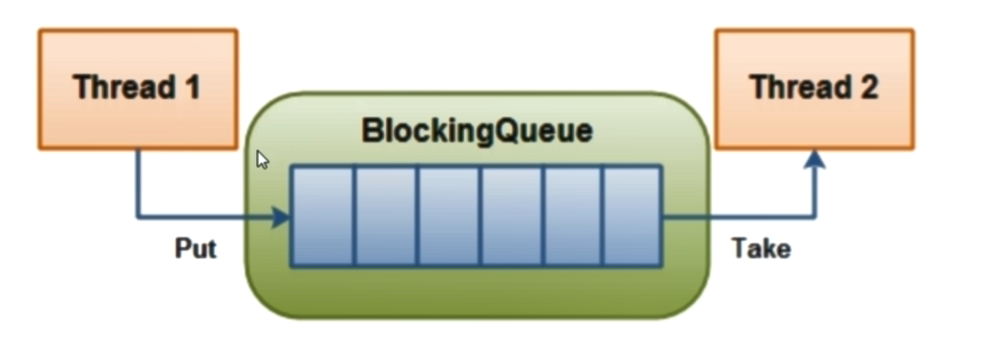
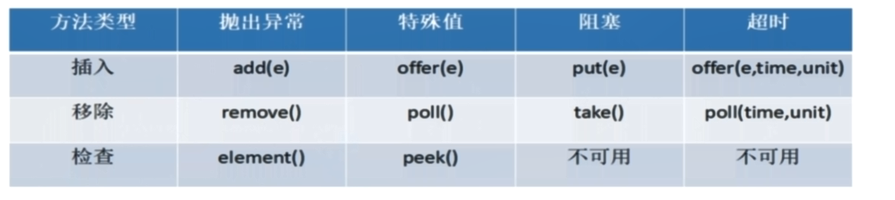

# 阻塞队列

阻塞队列顾名思义，首先它是一个队列，而一个阻塞队列在数据结构中所起的作用大致可以如下图所示：



线程1往阻塞队列中添加元素，线程2从阻塞队列中移除元素。

当阻塞队列为空的时候，从队列中获取元素的操作将会被阻塞。

当阻塞队列为满的时候，从队列中添加元素的操作将会被阻塞。

同样：试图向已经满的阻塞队列中添加新元素的线程同样也会被阻塞，直到其他线程从队列中移除一个或多个元素，又或者完全清空队列后使得队列重新变得空闲起来并后续新增。

在多线程领域：所谓阻塞，在某些情况下会挂起线程（即阻塞），一旦条件满足，被挂起的线程又会自动被唤醒。

**为什么需要BlockingQueue？**

好处：我们不在需要关心什么时候需要阻塞线程，什么时候需要唤醒线程，因为这一切BlockingQueue都给你一手包办了。在concurrent包发布以前，在多线程环境下，每个程序员都必须去自己控制这些细节，尤其还要兼顾效率和线程安全，而这会给我们的程序带来不小的复杂度。


BlockingQueue工作常用的API



**抛出异常**

add(e)：插入方法，当阻塞队列满时，在向向队列里边add插入元素会抛出java.lang.IllegalStateException异常

poll：移除方法，当阻塞队列空的时候，在向阻塞队列中remove元素会抛出java.util.NoSuchElementException异常。

Element：返回队列中的队首元素，如果阻塞队列为空抛出java.util.NoSuchElementException

**特殊值**

offer(e)：插入方法，插入成功返回ture，失败返回false。与add的区别时add插入失败会抛出异常。

poll：移除方法，移除成功返回返回队列中的元素，队列中没有返回null，相比与remove不会抛出异常

peek：返回队列中队首元素，如果阻塞队列为空则返回null，相比于Element方法不会抛出异常。


**阻塞**

put(e)：向阻塞队列中添加元素，当阻塞队列满的时候，生产者线程继续向队列里边put元素，队列会一直阻塞生产者线程，直到队列不满可以成功put数据或者响应中断退出。

take()：从阻塞队列中移除元素，当阻塞队列为空的时候，消费者线程试图往队列里take元素，队列会一直阻塞消费者线程直到队列中有元素可用。


**超时退出**

offer(e,time,unit)：跟put功能相似，不同点当阻塞队列满的时候，队列阻塞生产者线程一定时间，超过限时后生产者线程退出。

poll(time,unit)：跟take功能相似，不同点当阻塞队列空的时候，队列阻塞消费者线程一定时间，超过限时后消费者线程退出。

# 常用的阻塞队列

**ArrayBlockingQueue:由数组结构组成的有界阻塞队列**


**LinkedBlockingQueue：由链表组成的有界（但是大小默认值为Integer.MAX_VALUE=2147483647）阻塞队列**，由于它的默认值太大，所以我们new一个LinkedBlockingQueue一定要指定初始值大小


PriorityBlockingQueue：支持优先级排序的无界阻塞队列


DelayQueue：使用优先级队列实现的延迟无界阻塞队列

LinkedTransferQueue：由链表结构组成的无界阻塞队列

LinkedBlocking**Deque**：由链表结构组成的双向阻塞队列

注意：Queue一般是单向链表，Deque是双向链表。


**SynchronousQueue：不存储元素的阻塞队列，也即单个元素的队列**，与其他BlockingQueue不同SynchronousQueue是一个不存储元素的BlockingQueue，每一个put操作必须要等待一个take操作，否则不能添加元素，反之亦然。

```java
public class BlockingQueueDemo {
    public static void main(String[] args) {
        BlockingQueue<Integer> queue =new SynchronousQueue<>();

          new Thread(()->{

              try {
                  System.out.println(Thread.currentThread().getName()+"  put  " + 1);
                  queue.put(1);
                  System.out.println(Thread.currentThread().getName()+"  put  " + 2);
                  queue.put(2);
                  System.out.println(Thread.currentThread().getName()+"  put  " + 3);
                  queue.put(3);

              } catch (Exception e) {
                  e.printStackTrace();
              }

          },"AAA").start();
          
          new Thread(()->{
             try {
                 try{ TimeUnit.SECONDS.sleep(3); } catch (Exception e) { e.printStackTrace(); }
                 System.out.println(Thread.currentThread().getName()+" take "+queue.take());
                 try{ TimeUnit.SECONDS.sleep(3); } catch (Exception e) { e.printStackTrace(); }
                 System.out.println(Thread.currentThread().getName()+" take "+queue.take());
                 try{ TimeUnit.SECONDS.sleep(3); } catch (Exception e) { e.printStackTrace(); }
                 System.out.println(Thread.currentThread().getName()+" take "+queue.take());
              } catch (InterruptedException e) {
                  e.printStackTrace();
              }

          },"BBB").start();

    }

}

AAA  put  1
BBB take 1  //AAA  put  1 3秒钟后BBB take 1
AAA  put  2
BBB take 2
AAA  put  3
BBB take 3
```


**生产者消费者传统版**

```java

class Buffer{
    private int num;
    boolean flag = true;

    public void increase(){
        synchronized (this){
            //wait的判断条件为了防止虚假唤醒要使用while做判断
            while(!flag){
                try {
                    this.wait();
                } catch (Exception e) {
                    e.printStackTrace();
                }

            }

            num++;
            flag = false;
            System.out.println(Thread.currentThread().getName()+" : "+num);
            this.notifyAll();

        }

    }
    public void decrease(){
       synchronized (this){
           //为了防止虚假唤醒要使用while做判断
           if(flag){
               try {
                   this.wait();
               } catch (InterruptedException e) {
                   e.printStackTrace();
               }
           }
               num--;
               flag = true;
               System.out.println(Thread.currentThread().getName()+" : "+num);
               this.notifyAll();


       }
    }

}

public class ThreadCommunication {
    public static void main(String[] args) {
        Buffer buffer = new Buffer();
        new Thread(()->{
            for (int i = 0; i < 5; i++) {
                buffer.increase();
            }

          },"AAA").start();
          new Thread(()->{
              for (int i = 0; i < 5; i++) {
                  buffer.decrease();
              }

           },"BBB").start();
    }
}
```


**线程通信阻塞队列版**


